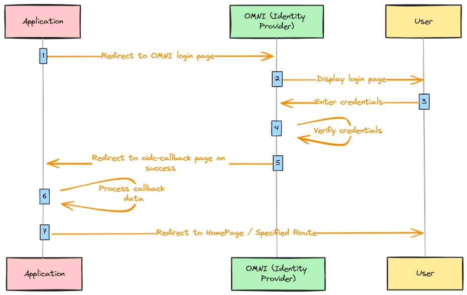

**Authentication Guide**

This guide provides insights into the authentication process implemented within our project.

**Authentication Method:**
Authentication is facilitated through the `oidc-client` library using OMNI as the Identity Provider (IDP).

**Process Overview:**

1. **Application Redirect:** The application redirects the user to the OMNI login page.
2. **OMNI Login Page Display:** The OMNI login page is displayed to the user.
3. **User Credential Entry:** Users enter their credentials on the OMNI login page.
4. **Credential Verification:** The system verifies the entered credentials.
5. **Success Redirect:** Upon successful verification, users are redirected to the oidc-callback page.
6. **Callback Data Processing:** Data from the callback is processed by the system.
7. **Final Redirect:** Users are then redirected to the Homepage or a specified route within the application.

**Illustration:**

