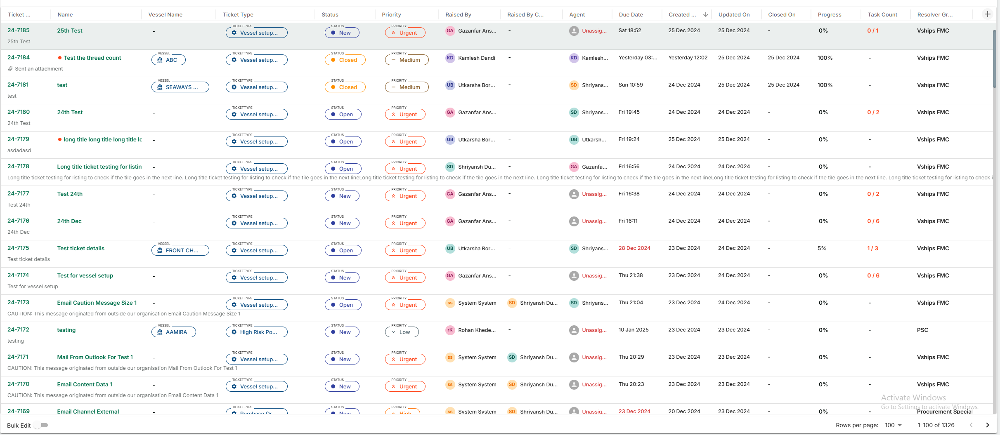
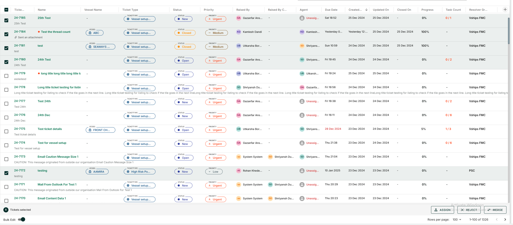
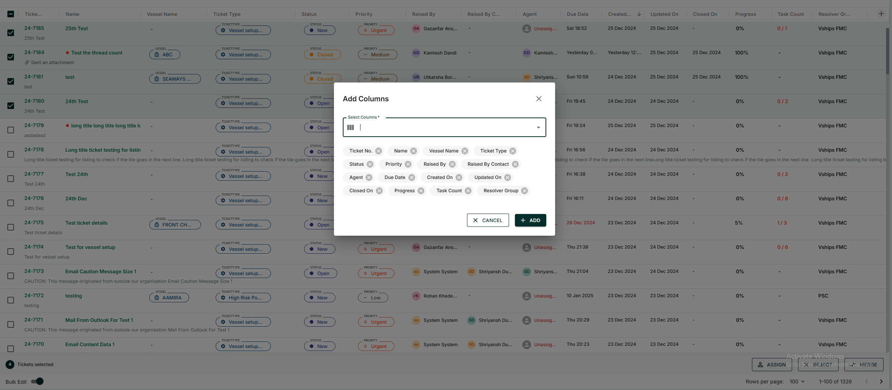

## VDataGridTable Documentation


The VDataGridTable component is a highly flexible and customizable Data Grid table designed for React applications. It offers a wide range of features, including dynamic column management, pagination, sorting, filtering, and bulk editing, all while providing seamless integration with your application's data.


### Features
- `Dynamice columns :`This feature is particularly useful for scenarios where the column visibility needs to change based on user actions, such as add, remove and reorder columns.
- `Custom Filtering:`You can create complex filtering logic on column level.
- `Pagination and Sorting:` Enable the sever side pagination and sorting.
- `Draggable:` User can drag the row value and drop on the search.
- `Search and Row Data Filtering: ` When a search value is provided, the table will automatically filter its rows to match the search query, allowing users to easily find specific data.
- `Bulk Editing: ` Bulk editing multiple rows in the table simultaneously.
- `Custom Cells: ` This feature is particularly useful when you want to customize the content of a specific column, format values, or render complex components inside a cell.


# Installation

- First, install the @vplatform/shared-components package from npm:

```
npm install @vplatform/shared-components

```


## Usage

Import the VDataGridTable component into your project with required props:


```

import {VDataGridTable} from '@vplatform/shared-components';

const DataGridTable = () => {

    const dynamicViewColumns = [
        {
            field: "status",
            headerName: "Status",
        },
        {
            field: "PRIORITY",
            headerName: "Priority",
            minWidth: 150,
        },
        {
            field: "createdBy",
            headerName: "Raised By",
        },
        {
            field: "createdByContact",
            headerName: "Raised By Contact",
        },
        {
            field: "ASSIGNEDTO",
            headerName: "Agent",
            sortable: false,
        },
  ]
  	
    const allrows = [
            {
                taskId: 17652,
                status: "New",
                PRIORITY: "Urgent",
                createdBy: "Rohit Kule",
                createdByContact: "",
                ASSIGNEDTO: "Unassigned",
                lastMessage: {
                hasUnreadMessages: false,
                lastMessageContent: "",
                isLastMessageAttachment: false,
                },
            },
            {
                taskId: 17646,
                status: "New",
                PRIORITY: "Urgent",
                createdBy: "Mrunali Sawant",
                createdByContact: "",
                ASSIGNEDTO: "Unassigned",
            },
            {
                taskId: 17645,
                status: "New",
                PRIORITY: "Urgent",
                createdBy: "Mrunali Sawant",
                createdByContact: "",
            },
    ]

    const configMapping = {
        status: {
            config,
            configKey: "STATUS",
            configColor: "light",
            multiKey: "key",
            chip: true,
        },
        PRIORITY: {
            config,
            configKey: "PRIORITY",
            configColor: "light",
            multiKey: "key",
            chip: true,
        },
        createdBy: {
            avatarText: true,
            configKey: "createdBy",

            contactIdKey: "raisedBy",
            isClickable: true,
        },
        createdByContact: {
            avatarText: true,
            configKey: "createdByContact",
            isClickable: true,
        },
        ASSIGNEDTO: {
            avatarText: true,
            configKey: "ASSIGNEDTO",
            contactIdKey: "assignedToId",
        }
    }


    return (
            <VDataGridTable
                dynamicViewColumns = {dynamicViewColumns}
                allrows = {allrows}
                configMapping= {configMapping},
            />
    )
}
```


### Prop Details

The VDataGridTable component accepts a variety of props that allow you to control its behavior and appearance.


| **Prop Name**                   | **Type**                                                            | **Description**                                                                                  | **Required**  |
|----------------------------------|---------------------------------------------------------------------|--------------------------------------------------------------------------------------------------|---------------|
| `mode`                           | `boolean`                                                          |  Determines the color scheme; `true` for dark mode, `false` for light mode. Default is `false`    | No            |
| `addColumnOptions`               | `addColumnOptionsTypes`                                             | Options for adding columns dynamically.                                                          | No            |
| `dynamicViewColumns`             | `GridColDef[]`                                                      | Array of column definitions that determine the structure and appearance of the table columns.    | Yes           |
| `addEmptyColumn`                 | `boolean`                                                          | Whether to add an empty column to the end of the table.. Defaults to `false`.                      | No            |
| `AdvanceCustomFilter`            | `React.FC<AdvanceCustomFilterProps>`                                | Custom filter component that can be used to apply advanced filters to the data grid at column level.   | No            |
| `tableWidth`                     | `string`                                                           | Defines the width of the table. By default is 800px                                              | No            |
| `tableHeight`                    | `number` or `undefined`                                               | Defines the height of the table.                                                                  | No            |
| `paginationState`                | `paginationStateTypes`                                             | Pagination state for controlling pagination behavior.                                            | No            |
| `configMapping`                  | `any`                                                               | Custom configuration mapping for the data grid.                                                  | Yes            |
| `iconMap`                        | `iconMapType`                                                       | Custom mapping for icons used in the table, if applicable.                                       | No            |
| `allrows`                        | `any[]`                                                             | Array of data rows to be displayed in the table.                                                  | Yes           |
| `handleColumnWidthChange`        | `GridEventListener<"columnWidthChange">`                            | Handler function to respond to changes in column width.                                          | No            |
| `handleColumnOrderChange`        | `GridEventListener<"columnOrderChange">`                            | Handler function to respond to changes in column order.                                          | No            |
| `slots`                          | `Partial<GridProSlotsComponent>`                                    | Custom slots for customizing parts of the data grid (e.g., header, footer). Like showing `No result found`                     | No            |
| `dispatchSetColumns`             | `(columns: any[]) => void`                                          | Callback to update the columns dynamically.                                                      | No            |
| `selectedOptions`                | `any[]`                                                             | Array of selected options, if applicable. This prop will be use when you want to search the data using from search component. According to the selected value table row will be update  | No |
| `onRowClick`                     | `(taskId: number) => void`                                          | Callback to handle row click events. Receives `taskId` as an argument.                          | No            |
| `onRowDoubleClick`               | `(taskId: number) => void`                                          | Callback to handle row double-click events. Receives `taskId` as an argument.                    | No            |
| `setSortModel`                   | `any`                                                               | Function to set the sort model for the table.                                                    | No            |
| `sortModel`                      | `any`                                                               | The current sorting model for the data grid.                                                     | No            |
| `tableLoading`                   | `boolean`                                                          | Whether the table api is in a loading state. Defaults to `false`.                                    | No            |
| `BulkEdit`                       | `BulkEditType`                                                      | Enables bulk editing of rows in the data grid.                                                   | No            |
| `contactComponent`               | `React.ReactElement`                                                | Custom React component to be rendered in the table, often for individual cell customization.      | No            |
| `selectedTicket`                 | `any`                                                               | Represents the selected ticket, if applicable.                                                   | No            |
| `asyncColumnLoading`             | `asyncColumnLoadingTypes`                                           | Type defining the async loading behavior for columns.                                           | No            |
| `AdvanceColumnLevelFilter`       | `AdvanceColumnLevelFilter`                                          | Custom column level filter for advanced filtering of columns in the data grid.                  | No            |
| `onRowOrderChange`               | `GridEventListener<"rowOrderChange">`                               | Handler function to respond to changes in row order.                                             | No            |
| `rowReordering`                  | `boolean`                                                          | Whether row reordering is enabled. Defaults to `false`.                                          | No            |
| `disableColumnSorting`           | `boolean`                                                          | Disables column sorting. Defaults to `false`.                                                    | No            |


### `addColumnOptionsTypes`

The `addColumnOptionsTypes` interface is used to define the options for adding columns dynamically to the `VDataGridTable`. It provides flexibility for customizing the behavior and structure of the columns. Below are the individual properties of this interface:

| **Prop Name**           | **Type**                                                | **Description**                                                                                                  | **Required** |
|------------------------|---------------------------------------------------------|------------------------------------------------------------------------------------------------------------------|--------------|
| `defaultColumn`         | `GridColDef[]`                                          | An array of column definitions that will be used as the default set of columns for the grid.                    | Yes           |
| `addColumnsValue`       | `() => Record<string, any>`                             | A function that returns a record of values to be used for adding new columns. This allows for dynamic column creation. | No           |
| `setUpdateExtraColumn`  | `React.Dispatch<React.SetStateAction<boolean>>`         | A function that toggles a boolean value (`true`/`false`) to indicate whether additional columns should be updated or not on add button. | No           |
| `updateExtraColumn`     | `boolean`                                               | A boolean value indicating whether extra columns should be updated or not. Default is `false`.                  | No           |


### `AdvanceCustomFilterProps`

The `AdvanceCustomFilterProps` interface defines the structure for the advanced custom filter component in the `VDataGridTable`. It provides the necessary properties to enable filtering functionality on table rows based on custom logic.

| **Prop Name**       | **Type**    | **Description**                                                                                   | **Required** |
|----------------------|-------------|---------------------------------------------------------------------------------------------------|--------------|
| `header`            | `any`       | Represents the header configuration or metadata used to identify and manage column filtering.    | Yes          |
| `rows`              | `any[]`     | An array of row data on which the custom filter logic will be applied.                           | Yes          |
| `filterEnabled`     | `boolean`   | A flag indicating whether the custom filter is enabled or disabled. Defaults to `false`.         | Yes          |


### `paginationStateTypes`

The `paginationStateTypes` interface defines the structure and behavior for managing pagination in the `VDataGridTable`. It includes properties and functions for tracking and controlling the current page, page size, and total rows.

| **Prop Name**   | **Type**                                      | **Description**                                                                                 | **Required** |
|------------------|-----------------------------------------------|-------------------------------------------------------------------------------------------------|--------------|
| `page`          | `number`                                      | The current page number in the data grid.                                                      | Yes          |
| `setPage`       | `React.Dispatch<React.SetStateAction<number>>`| A function to update the current page number.                                                  | Yes          |
| `pageSize`      | `number`                                      | The number of rows displayed per page.                                                         | Yes          |
| `setPageSize`   | `React.Dispatch<React.SetStateAction<number>>`| A function to update the number of rows displayed per page.                                     | Yes          |
| `totalRows`     | `number`                                      | The total number of rows available in the data grid.                                            | Yes          |


### `configMapping`

These props allow the dynamic rendering of cell content based on various configurations. It supports rendering chips, text, dates, avatars with text, and custom components

`Example` : 
```
export const configMapping = {
  status: {
    config,
    configKey: "STATUS",
    configColor: "light",
    multiKey: "key",
    chip: true,
  },
  PRIORITY: {
    config,
    configKey: "PRIORITY",
    configColor: "light",
    multiKey: "key",
    chip: true,
  },
  createdBy: {
    avatarText: true,
    configKey: "createdBy",
    contactIdKey: "raisedBy",
    isClickable: true,
  },
  createdByContact: {
    avatarText: true,
    configKey: "createdByContact",
    isClickable: true,
  },
  ASSIGNEDTO: {
    avatarText: true,
    configKey: "ASSIGNEDTO",
    contactIdKey: "assignedToId",
  },

}
```

| Prop Name            | Type     | Default Value | Description                                                                                       |
|----------------------|----------|---------------|---------------------------------------------------------------------------------------------------|
| `value`             | `any`    | `undefined`   | The main value to be displayed in the cell.                                                      |
| `config`            | `any`    | `undefined`   | Configuration object for custom logic or rendering. [Config Data Link](configData.json)        |
| `configKey`         | `string` | `undefined`   | A unique key to identify the configuration for the cell.                                         |
| `configColor`       | `string` | `undefined`   | Defines the color used for the cell content or decorations. `Example`  const configColor = mode ? "dark" : "light";  |
| `iconImage`         | `string` | `undefined`   | The name icon image used within the cell.When `chip` prop is true then use iconImage .`Example` : iconImage: "DirectionsBoatFilledOutlinedIcon" |
| `multiKey`          | `string` | `undefined`   | Sub-keys defining specific states or priorities for nested categorization.`multiKey` should be present in [Config Data Link](configData.json) |
| `chip`              | `boolean`| `false`       | If `true`, renders a chip component within the cell.                                             |
| `text`              | `boolean`| `false`       | If `true`, renders a text component.                                                            |
| `avatarText`        | `boolean`| `false`       | If `true`, renders an avatar with text.                                                         |
| `date`              | `boolean`| `false`       | If `true`, renders a date component.                                                            |
| `textWithSubtext`   | `boolean`| `false`       | If `true`, renders text with a subtext.                                                         |
| `showOverDueErroRed`| `boolean`| `undefined`   | If `true`, highlights overdue date items in red.                                                     |
| `iconComponent`     | `ReactNode` | `undefined` | A React component to render as an icon within the cell .When `chip` prop is true then use iconComponent .`Example` iconComponent: <DirectionsBoatFilledOutlinedIcon />|
| `subTextKey`        | `string` | `undefined`   | The key for retrieving subtext data from the row object in textWithSubtext component.          |
| `row`               | `any`    | `undefined`   | The row data object containing information for rendering.                                        |
| `customComponent`   | `boolean`| `false`       | If `true`, renders a custom React component inside the cell.                                                    |
| `CustomComponents`  | `React.ComponentType` | `undefined` | A custom component to be rendered inside the cell.                                              |
| `iconMap`           | `IconMapType` | `undefined`   | A map of icons for dynamic rendering. When `chip` prop is true then use iconMap                                                           |
| `textColor`         | `string` | `undefined`   | Color of the text content. When text or date prop true then use textColor                     |
| `textVariant`       | `string` | `undefined`   | Typography variant for the text content. When text or date prop true then use textVariant                                                          |
| `percentage`        | `boolean`| `false`       | If `true`, displays the text as with percentage sign. When text prop is true.                                                |
| `isClickable`       | `boolean`| `false`       | If `true`, enables click functionality on the cell content. When text, avatarText or textWithSubtext is true  |
| `cellClickHandlers` | `object` | `undefined`   | Handlers for cell interactions, e.g., `onRowDoubleClick`.                                        |
| `reddot`            | `boolean`| `undefined`   | If `true`, displays a red dot alongside the text. When text prop is true                                               |
| `contactComponent`  | `ReactNode` | `undefined` | A React component for displaying contact-related data.When click on the avatar.                                           |
| `draggable`         | `boolean`| `true`   | If `true`, makes the cell content draggable. When text props is true                                                     |
| `asyncColumnLoading`| `asyncColumnLoadingTypes` | `undefined`   | Contains flags for asynchronous loading states of specific column types. when text or avatarText true                       |
| `asyncLoading`      | `boolean`| `undefined`   | If `true`, indicates asynchronous loading for the cell. when text is true                                         |

### `IconMapType`

- Used to map string identifiers to React components that represent icons. This mapping simplifies referencing and rendering icons dynamically in the UI.
- It is an object where the keys are string identifiers, and the values are React elements.
- Each React element represents an icon and can use any valid React component.

- Example 

```
type IconMapType = {
  [key: string]: React.ReactElement<
    any,
    string | React.JSXElementConstructor<any>
  >;
};

export const iconMap: IconMapType = {
  settingIcon: <SettingsIcon />,
  DirectionsBoatFilledOutlinedIcon: <DirectionsBoatFilledOutlinedIcon />,
  FiberManualRecordIcon: <FiberManualRecordIcon />,
};

```

### `asyncColumnLoadingTypes` 

- Contains two props  `asyncAgentsLoading` and `asyncTextLoading`

interface asyncColumnLoadingTypes {
  asyncAgentsLoading: boolean; avatarText
  asyncTextLoading: boolean; // text is ture
}


### `BulkEditType` 

The `BulkEditType` interface is used to manage bulk editing operations in the data grid. It provides state management for handling popups, row selections, and checkbox states.

| **Property**          | **Type**                                                 | **Description**                                                                 | **Required** |
|------------------------|----------------------------------------------------------|---------------------------------------------------------------------------------|--------------|
| `setAssignPopup`       | `React.Dispatch<React.SetStateAction<boolean>>`          | A function to toggle the visibility of the assign popup.                        | Yes          |
| `rowSelectionModel`    | `GridRowSelectionModel`                                  | Represents the current row selection model in the grid.                         | Yes          |
| `setRowSelectionModel` | `React.Dispatch<React.SetStateAction<GridRowSelectionModel>>` | A function to update the row selection model.                                   | Yes          |
| `setIsChecked`         | `React.Dispatch<React.SetStateAction<boolean>>`          | A function to toggle the checkbox state for selecting rows.                     | Yes          |
| `isChecked`            | `boolean`                                               | Indicates whether the checkbox for selecting rows is checked.                   | Yes          |
| `setRejectPopup`       | `React.Dispatch<React.SetStateAction<boolean>>`          | A function to toggle the visibility of the reject popup.                        | Yes          |
| `setMergePopup`        | `React.Dispatch<React.SetStateAction<boolean>>`          | A function to toggle the visibility of the merge popup.                         | Yes          |


### `AdvanceColumnLevelFilter` 

The `AdvanceColumnLevelFilter` type defines the structure and functionality of advanced filters for table columns. It includes methods for fetching filter options, handling filter value selection, determining if a column should have a filter, and supports the use of custom components.

| **Property**                 | **Type**                                                                                  | **Description**                                                                                                                                               | **Required** |
|-------------------------------|-------------------------------------------------------------------------------------------|---------------------------------------------------------------------------------------------------------------------------------------------------------------|--------------|
| `avialableOptions`           | `(rowsFilter: any, columnName: string) => Array<{ value: any; key: any; type: any; additionalData?: any; }>` | A function to generate available filter options for a specific column. It takes the current row filter and column name as arguments and returns an array of filter options. | Yes          |
| `handleFilterValueSelect`    | `(field: string, value: any) => void`                                                     | A function to handle the selection of a filter value. It takes the field name and the selected value as arguments.                                             | Yes          |
| `shouldNotHaveColumnFilter`  | `(field: string) => boolean`                                                              | A function to determine if a specific column should not have a filter. It takes the column name (field) as an argument and returns a boolean.                  | Yes          |
| `CustomComponent`            | `any`                                                                                    | An optional custom component for rendering the filter UI.                                                                                                     | No           |


### Below is the UI design for the table:








