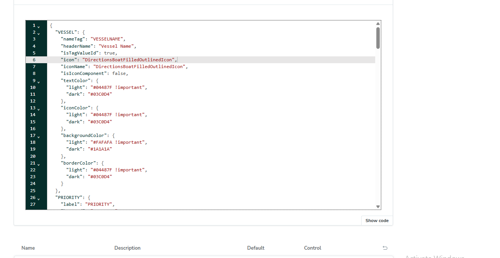
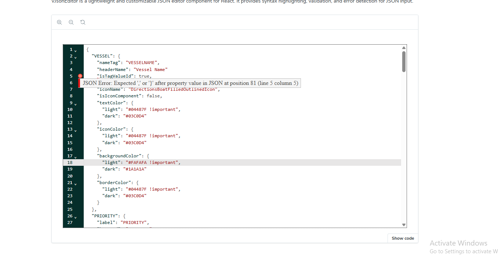
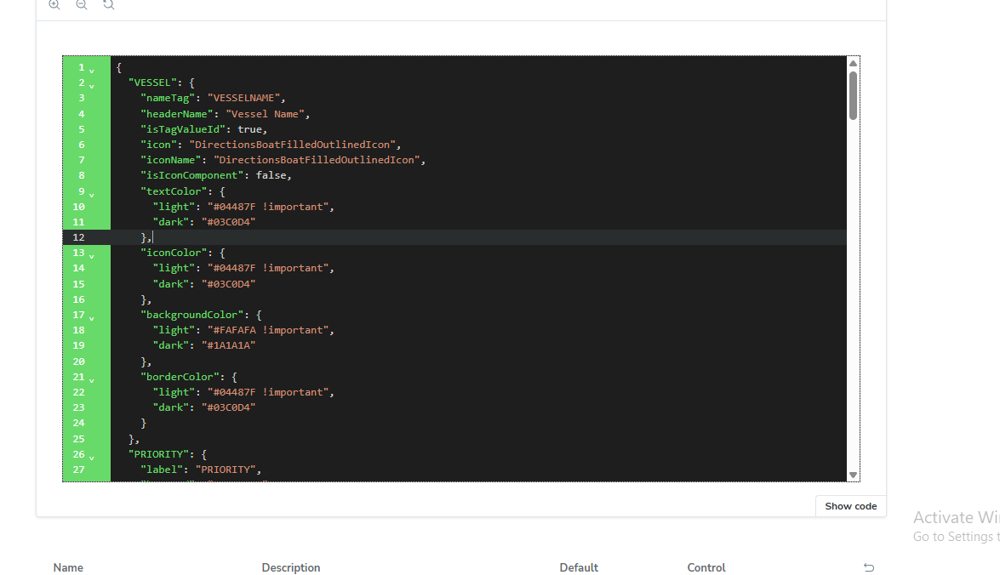

## VJsonEditor Documentation

VJsonEditor is a customizable JSON editor component for React. It provides syntax highlighting, validation, and error detection for JSON input. It is using codemirror package (@uiw/react-codemirror).


## Features

- JSON Syntax Highlighting: Uses CodeMirror to highlight JSON syntax.

- Validation: Displays error markers when JSON is invalid.

- Customizable Height: Adjust the editor height as needed.

- Dark Mode Support: Toggle between light and dark themes using the mode prop.

- Live Editing: Automatically updates the JSON value as users type.


## Installation

To install `VJsonEditor`, run the following command:

```
npm install @vplatform/shared-components
```


If the shared-components package is already installed, upgrade it to version 1.7.47 or above:

```
npm install @vplatform/shared-components@1.7.47

```


## Usage

Import and use VJsonEditor in your application:

```
import React, { useState } from "react";
import { VJsonEditor } from "@vplatform/shared-components";

const App = () => {

    const [jsonValue, setJsonValue] = useState(JSON.stringfy(JsonData, null, 2)); 

    return (
        <VJsonEditor
            jsonValue={jsonValue}
            setJsonValue={setJsonValue}
            height="600px"
            mode={true} // true for dark mode, false for light mode
        />
    );
};

export default App;

```


## Props

### 1 jsonValue (string, required)

The JSON string to be displayed in the editor.

### 2 setJsonValue (React.Dispatch<React.SetStateAction<string>>, required)

Callback function to update the JSON value when edited.

### 3 height (string, optional)

Defines the height of the editor (default: 500px).

### 4 mode (boolean, optional)

- If true, the editor will use a dark theme.

- If false, the editor will use a light theme (default).




