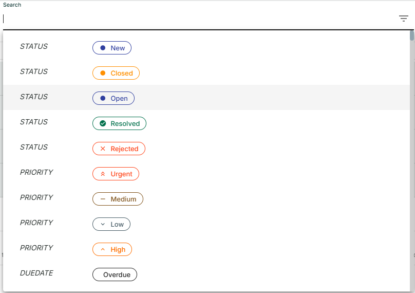
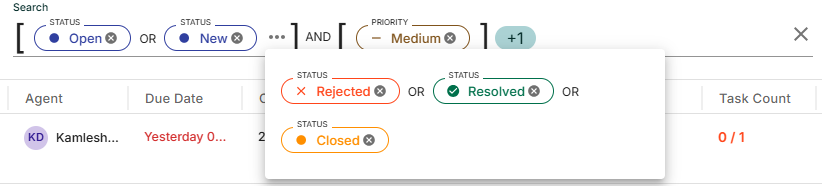

## VSearchInput Component

`VSearchInput` is a versatile search input component that allows users to select multiple options from a list with autocomplete functionality. It is designed to work with Material-UI and provides a user-friendly interface for filtering data based on user input.


### Features
- `Multi-Select:` Users can select multiple options from the dropdown list.
- `Dynamic Filtering:` The search input filters available options as the user types.
- `Clear Selection:` Users can clear their selections with a dedicated clear button.
- `Draggable Options:` Supports drag-and-drop functionality to add options to the selection.


## Installation

- First, install the @vplatform/shared-components package from npm:

```
npm install @vplatform/shared-components

```

## Usage

Import the VSearchInput component into your project with required props:


```

import {VSearchInput} from '@vplatform/shared-components';

const SearchInput = () => {

  	const [selectedOptions, setSelectedOptions] = useState<any[]>([]);
    

    const searchData = [
          {
            key: "STATUS",
            value: "New",
            type: "status",
          },
          // Additional data...
          {
            key: "CREATEDBY",
            value: "Rohit Kule",
            additionalData: "475c29c6-a2f2-4504-80d4-15c28d7d2afa",
            type: "createdBy",
          },
    ]


    let search = {
      searchData
    }

    return (
            <VSearchInput
                search = {search}
                setSelectedOptions={setSelectedOptions}
                selectedOptions={selectedOptions}
            />
    )
}
```

## Props

The `VSearchInput` component accepts the following props:

| Prop               | Type              | Default     | Required | Description                                                                                   |
|--------------------|-------------------|-------------|----------|-----------------------------------------------------------------------------------------------|
| `mode`             | `boolean`        | `false`     | No       | Determines the color scheme; `true` for dark mode, `false` for light mode.                    |
| `search`           | `searchTypes`    | `undefined` | No       | Object containing search-related configurations including `searchData`.`searchData` is required. |
| `searchBoxWidth`   | `string | number`| `600`       | No       | Width of the search box.                                                                      |
| `iconMap`          | `IconMapType`    | `undefined` | No       | Mapping for custom icons to be displayed in the search dropdown.                               |
| `configData`       | `any`            | `undefined` | No       | Additional configuration data for customization.                                              |
| `selectedOptions`  | `any[]`          | `[]`        | Yes      | Array of selected options.                                                                    |
| `setSelectedOptions`| `Function`      | `undefined` | Yes      | Function to update the selected options.                                                     |
| `setTableData`     | `Function`       | `undefined` | No       | Function to clean the table data according to selected option in search  |
| `queryToggle`     | `boolean`         | `true`      | No       | If false then hide the query toggle  |


### `searchTypes` Props

| Prop               | Type                                   | Default     | Required | Description                                                                                   |
|--------------------|----------------------------------------|-------------|----------|-----------------------------------------------------------------------------------------------|
| `searchData`       | `any[]`                               | `undefined` | Yes       | Array of data objects to display as options in the dropdown.Array must contains key, value     |
| `inputValue`       | `string`                              | `undefined` | No       | Current input value in the search box.                                                        |
| `setInputValue`    | `React.Dispatch<React.SetStateAction<string>>` | `undefined` | No       | Function to update the `inputValue`.                                               |
| `inputValueRef`    | `React.MutableRefObject<string>`      | `undefined` | No       | Reference to the current input value for more controlled updates.                            |
| `handleScroll`     | `(event: any) => void`                | `undefined` | No       | Callback function to handle scrolling events in the dropdown.Example Use this to load additional 25 search options dynamically as the user scrolls. |
| `searchLoading`    | `boolean`                             | `false`     | No       | Indicates if the search dropdown is in a loading state.                                       |
| `handleInputChange`| `(newInputValue: string) => void`     | `undefined` | No       | Function to handle changes in the search box input.                                           |


### `IconMapType` Props

- Used to map string identifiers to React components that represent icons. This mapping simplifies referencing and rendering icons dynamically in the UI.
- It is an object where the keys are string identifiers, and the values are React elements.
- Each React element represents an icon and can use any valid React component.

- Example 

```
type IconMapType = {
  [key: string]: React.ReactElement<
    any,
    string | React.JSXElementConstructor<any>
  >;
};

export const iconMap: IconMapType = {
  settingIcon: <SettingsIcon />,
  DirectionsBoatFilledOutlinedIcon: <DirectionsBoatFilledOutlinedIcon />,
  FiberManualRecordIcon: <FiberManualRecordIcon />,
};

```


## Design ConfigData 

[Config Data Link](configData.json)

JSON each top-level key should be match with `searchData` key 
### Top-Level Keys:

- Each top-level key (VESSEL, PRIORITY, STATUS) represents a distinct category of data. This key should be matched with `searchData` key
- These categories include metadata and visual customization for rendering.


### Each key contains specific properties:

- headerName: The label to display in the UI (e.g., "Vessel Name", "Priority").
- icon: The default icon component name (e.g., DirectionsBoatFilledOutlinedIcon).
- iconName: A human-readable identifier for the icon.
- isIconComponent: Boolean indicating if the icon is a React component.
- textColor, iconColor, backgroundColor, borderColor: Objects defining colors for light and dark themes.
- key: Sub-keys defining specific states or priorities for nested categorization.

### Below is the UI design for the Search Input:



