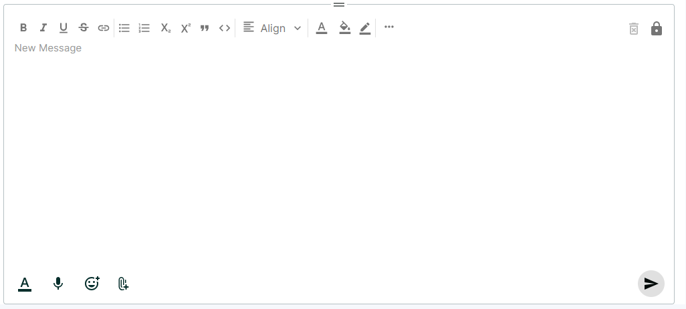
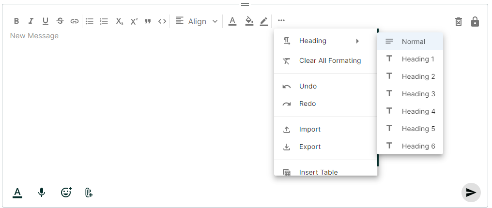
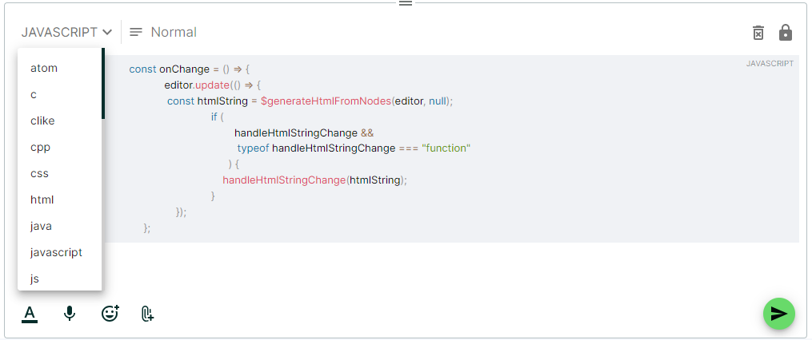
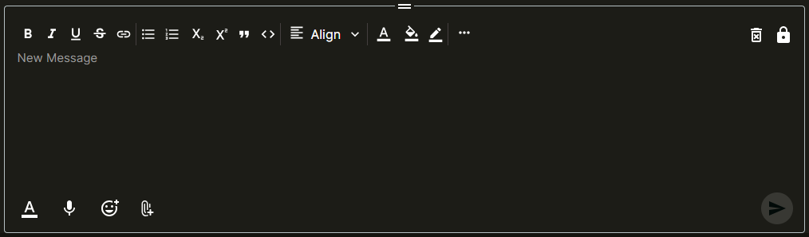

# VTextEditor Component

The VTextEditor component is a customizable text editor built using the Lexical text editor. This component offers various configuration options through its props, allowing you to integrate it seamlessly into your project.

## Features
- **Rich Text Editing** : Provides a robust text editing experience with a variety of formatting options.
- **Emoji Insertion** : Easily insert emojis into your text using the integrated emoji picker.
- **Mentions** : Implement user mentions with customizable suggestions.
- **Speech Recognition** : Use speech-to-text functionality to input text via voice commands.
- **Customizable Toolbars** : Configure toolbars to suit your needs, with support for both desktop and mobile views.
- **Read and Write Modes** : Switch between read-only and write modes to control whether the content is editable or view-only.
- **Background Color Picker**: Customize the background color of your text.
- **Import/Export in HTML or Markdown**: Import content from and export content to HTML or Markdown formats.
- **Table Support**: Create tables within the text editor.





## Installation

- First, install the @vplatform/shared-components package from npm:

```
npm install @vplatform/shared-components
```

## Usage

- Import the VTextEditor component into your project:

```
import VTextEditor from '@vplatform/shared-components';

const TextEditor = () => {
    return (
            <VTextEditor
                mode={mode}
                theme={theme}
                TopToolbar={true} 
                IconHeight = {'24px'}  
                IconWeight = {'24px'}     
                suggestions={suggestions}
                profileColor={profileColor}
                ClearEditor={clearEditor}
                handleHtmlStringChange={handleHtmlStringChange}
                isMobile={isMobile}     
                activeMic={activeMic}
                open = {open}
                setOpen = {setOpen}
                anchorEl = {anchorEl}
                showTextEditorOptions = {showTextEditorOptions}
                isMention = {isMention}
                showFooter = {showFooter}
                handlePastedFiles = {handlePastedFiles}
                initialContent = {initialContent}
                isDeleteContent = {isDeleteContent}
            />
    )
}


```


## Props

- Below is a detailed description of all the props that need to be passed to the VTextEditor component:

### 1. mode (boolean, options)
-  Determines the mode of the editor (e.g., dark or light mode).



### 2. TopToolbar (boolean)
- Toolbar in top of the editor.

### 3. theme (any, optional)
- Sets the theme of the editor, allowing for extensive customization of styles.

### 4. IconHeight(string, optional)

- Specifies the height of icons used in the toolbar. For example IconeHeight  = {'24px'}

### 5. IconWeight(string, optional)

- Specifies the height of icons used in the toolbar. For example IconeHeight  = {'24px'}

### 6. suggestions(optional) :- 
- Provides suggestions for mentions 
- Example usage:

```
interface Suggestions {
  id: number | string;
  name: string;
}

const suggestions: Suggestions[] = [
  {
    id: 3976,
    name: "User Name"
  },
  {
    id: "Everyone",
    name: "Everyone"
  }
];

```

### 7. profileColor(any, optional) :- 
- Sets the profile color for user mentions.
- For example :- 
```
backgroundColor: profileColor(option.id).backgroundColor,
color: profileColor(option.id).color,
```
- option.id comes from the suggestions

### 8. open(boolean,optional):- 
- Determines whether the emoji picker is visible

### 9. setOpen(callback, optional) :- 
- A callback function to set the state of the open prop. This function is called to show or hide the emoji picker.

### 10. anchorEl (HTMLElement | null, optional):- 
- The DOM element used as the anchor for the emoji picker.

### 11. ClearEditor(boolean, optional):- 

- It is mechanism to clear the editor content.

### 12. showTextEditorOptions(boolean):- 
- A boolean to control the visibility of additional text editor options.

### 13. isMention(boolean):-
- Indicates if the mention feature is enabled.

### 14. handleHtmlStringChange(function) : -

- A callback function that is called whenever the HTML string representation of the editor content changes. The function should accept a single argument which is the new HTML string.

### 15. isMobile (boolean,optional): 
- Indicates if the editor is being used on a mobile device. This can be used to conditionally render mobile-specific features.
- If isMobile is true then the footer won't be show in text editor. Footer functionality will be handle by props. 

### 16. activeMic(boolean,optional) :- 
-  Indicates if the speech-to-text microphone is active.

### 17. showFooter(boolean, optional):-
- This indicates to show the Format icon, Mic icon and Emoji icon in the footer. 
- By default this is ture. 

### 18. handlePastedFiles(Callback, optional):-
- Indicated copy paste image callback. 

### 19. initialContent(string, optional):- 
- A string representing the initial content to be displayed in the editor upon initialization.
- For Example:- initialContent will be - 
- let initialContent= '<p class="editor-paragraph" dir="ltr"><span style="white-space: pre-wrap;">Some messages.....</span></p>'

### 20. isDeleteContent(boolean, optional):- 
- This prop will hide the clear text icon and the read/write mode icons, if isDeleteContent true.
- By default isDeleteContent false. 

### 21. showSendButton(boolean, optional):- 
- This prop is used that will show the send icon button.
- By default showSendButton false.

### 22. showAllIcon(boolean, optional):- 
- This prop is used to show all the icons.
- By default showAllIcon false.

### 23. activeSidebar(string, optional):- 
- This prop is used to show the icons only for sidebar.

### 24. signatureDropdown(any, optional):- 
- This prop is used to disable/enable the signature icon for changing signature.

### 25. setSignatureMenu(any, optional):- 
- This prop is used to open signature menu options to select the signature.

### 26. setMenuPosition(any, optional):- 
- This prop is used to set the position of signature options menu.

### 27. isEmailChat(boolean, optional):- 
- This prop is used to show the signature icon only for email chat.
- By default isEmailChat false.

### 28. showGPT(boolean, optional):- 
- This prop is used to show the vpilot icon.
- By default showGPT false.

### 29. addMentionFuncRef(any, optional):- 
- This prop will be used for showing pilot functionality also.

### 30. pilotContact(any, optional):- 
- This prop will be used for parameter to pass in addMentionFuncRef.

### 31. COMMON_CDN_BASE_URL(any, optional):- 
- This prop will be used for vpilot icon.

### 32. onSend(function, optional):- 
- This prop is used is used when we click on send icon button for sending message.

### 33. isHideSendBtn(boolean, optional):- 
- This prop is used to hide the send icon button.
- By default isHideSendBtn false.

### 34. btnisDisable(string, optional):- 
- This prop is used to disable the send icon button.
- By default btnisDisable true.

### 35. handleAttachFile(function, optional):- 
- This prop is used to add the attachment using attachment icon, showAttachment should be true for this prop.

### 36. showAttachment(boolean, optional):- 
- This prop is used to show the attachment icon.
- By default showAttachment false.

### 37. enterKeyFunc(callback, optional):- 
- This prop is used for on click functionality of enter key.

### 38.isActionButtonHorizontal(boolean, optional):-								 
- This prop is used to have horizontal View of textEditor 

### 39. setIsActionButtonHorizontal(callback, optional):- 
- This prop is used for toggling the value of isActionButtonHorizontal

### 40. cannedResponseModel({ cannedResponseDropdown?: any[], cannedContent?: string, setCannedResponseMenu?: function }, optional):- 
- This prop in combination is used for showing a button which on click will open a popup in VChat which contains list of auto-replies and when we select an option the text which we want to display can be sent to text editor which it will append in the editor.

cannedResponseDropdown : list of the options used for checking if the button of cannedResponse should be disabled or not.
cannedContent : message after selection which we want to display in the editor.
setCannedResponseMenu : callback function which is called from editor to let the parent application know the button has been clicked to show the popup.


### 41 . onQueryChange (callback , optional) :-

This props is used as callback function which gets a query string (mention search string) and performs debounce on the same on the host application


### 42 isDebounceLoading (boolean , optional) :- 

This prop is used to show the Loading Ui when the debounce function is being executed .


### 43 isInNewChat(boolean, optional):- 

- This prop is used to show the description icon only for new email chat.
- By default isInNewChat false.


### 43 descriptionContent(any, optional):- 

- This prop is used as the description content to be displayed in the editor.

### 44 showAutoTagOptions(boolean, optional):- 
- This prop is used as a flag for enabling the tags recommendation dropdown when < is pressed for adding a tag.

### 45 autoTagsKeyList(string[], optional):- 
- This prop is used to send the list of data that needs to be displayed in the tags suggestion dropdown when < is pressed.


### 43 tableResizePortalId (string, optional):-
This prop takes the dialog ID. If your table is not resizing and your text editor is inside a dialog, pass the dialog's ID to this prop and use it.


### 44. getDocumentImage?: (src: string) => any; 
That is callback which take the image src url. which can be used to creates it into base64 string. 


### 45. Image and attachment size limit props: 

### i sizeLimitExceeded?: boolean;
- size limit exceed true and false state. If true you can show the toaster which is used in your host application

### ii setSizeLimitExceeded?: (x: boolean) => void;
- You can false the popup on clean up useeffect or any other event. 

### iii totalSizeLimitChat?: number;
- Initial totalSizeLimitChat is 0. According the text and inline images size increase in texteditor, the totalSizeLimitChat will update. 

### iv setTotalSizeLimitChat?: (x: number) => void;
- Update state of totalSizeLimitChat.

### v totalAttachmentSizeLimitChat?: number;
- Calculate your attachment size and pass that props to texteditor. Texteditor will add that size in our total size (including text and inline image size). 

### 47 isEmbeddedImageVDocument undefined (boolean, optional):-
This prop takes the boolean value if the inline image on VTextEditor has to be uploaded to VDocumentFileUploader. 

### 48 uploadInlineDocument (file: File, onSuccess?: ((src: string, documentId: number) => void), optional):-
a. This prop takes a method which is called when isEmbeddedImageVDocument is true and an image is pasted on the editor. 
b. This method contains accepts file as a parameter and an optional onSuccess method. 
c. This method body should contain code to upload file to VFileuploader and pass updated src url and documentId to callback method. 


