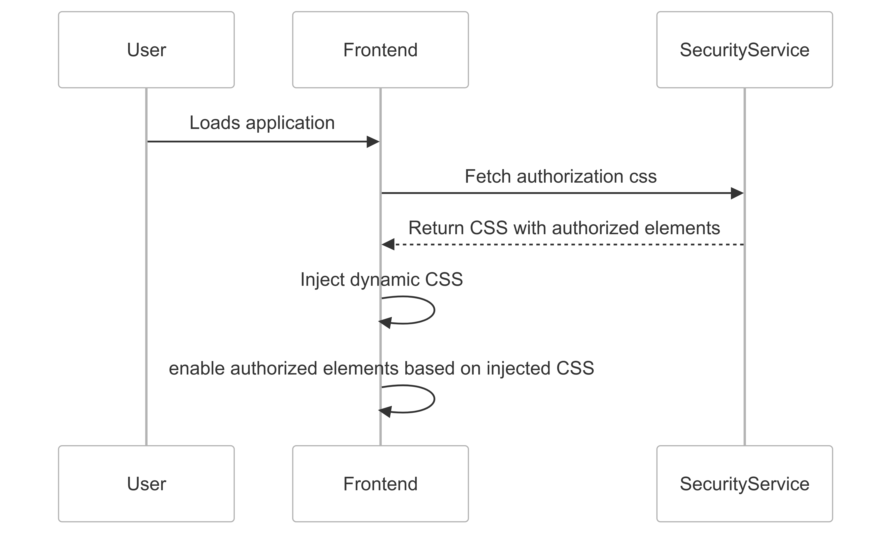
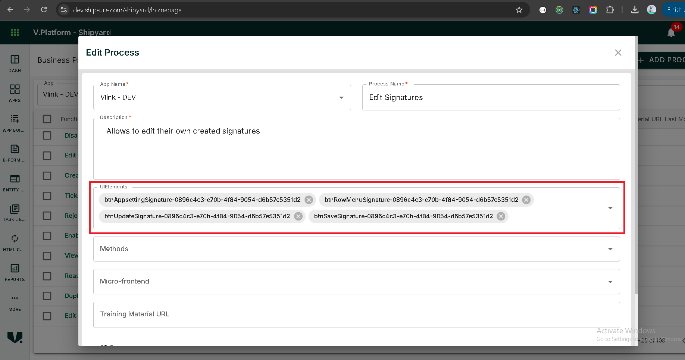

# Authorization Implementation Guide

## Overview
This guide provides a step-by-step implementation process for handling authorization in the application by dynamically injecting CSS styles for UI elements based on user access levels.

---

### **Authorization Workflow**



## Step 1: Define CSS for Access Control
Create a CSS file to define styling for action elements that need to be controlled based on user authorization.

### **File Path:**
`public/css/access-control.css`

In this below example 

`#btnUpdateDetails-0896c4c3-e70b-4f84-9054-d6b57e5351d2`,

`#btnUpdateDetails-` is `elementId` and `0896c4c3-e70b-4f84-9054-d6b57e5351d2` is `clientId`.


### **Example CSS:**
```css
#btnUpdateDetails-0896c4c3-e70b-4f84-9054-d6b57e5351d2,
#btnHistoryTab-0896c4c3-e70b-4f84-9054-d6b57e5351d2,
#btnReportingNoteDetails-0896c4c3-e70b-4f84-9054-d6b57e5351d2,
#btnEditResolverGroupTags-0896c4c3-e70b-4f84-9054-d6b57e5351d2,
#btnDeleteResolverGroupTags-0896c4c3-e70b-4f84-9054-d6b57e5351d2,
#btnEditSLATags-0896c4c3-e70b-4f84-9054-d6b57e5351d2,
#btnDeleteSLATags-0896c4c3-e70b-4f84-9054-d6b57e5351d2,
#btnDeleteTicketTypeTags-0896c4c3-e70b-4f84-9054-d6b57e5351d2 {
    pointer-events: none;
    opacity: 0.38;
}
```

---

## Step 2: Assign Dynamic ID in HTML
To ensure IDs are dynamic based on the `CLIENT_ID`, use template literals to construct unique identifiers.

### **Example Usage in React Component:**
```tsx
<Button
    size="small"
    id={`btnUpdateDetails-${process.env.NEXT_PUBLIC_CLIENT_ID}`}
>
    Update
</Button>
```

---

## Step 3: Fetch and Inject CSS Dynamically
On application startup, call a security service API to fetch the CSS configuration dynamically and inject it into the application.

### **Reference PRs:**
- [API method](https://dev.azure.com/vgroupframework/VPlatform-Apps/_git/VLink-APP?path=/src/services/security.service.ts&version=GBDEV&line=7&lineEnd=18&lineStartColumn=1&lineEndColumn=3&lineStyle=plain&_a=contents)
- [API call](https://dev.azure.com/vgroupframework/VPlatform-Apps/_git/VLink-APP/commit/0a15b5dd7a35638f145f347720aa935c25943977)

---

## Step 4: Create a Script for Client ID Replacement
A script should be created to replace the `clientId` in the CSS file before deployment.

### **File Path:**
`scripts/replace-client-id-in-css.js`

in this below need to change the `devClientId` with your clientId.

### **Example Script:**
```javascript
require('dotenv').config();
const fs = require('fs').promises;
const path = require('path');

const cssFilePath = path.join(__dirname, '..', 'public', 'css', 'access-control.css');
const devClientId = '0896c4c3-e70b-4f84-9054-d6b57e5351d2';
const newClientId = process.env.NEXT_PUBLIC_CLIENT_ID;

if (!newClientId) {
  console.error('Error: NEXT_PUBLIC_CLIENT_ID is not defined in the .env file');
  process.exit(1);
}

async function updateCssFile() {
  try {
    const data = await fs.readFile(cssFilePath, 'utf8');
    const updatedData = data.replace(new RegExp(devClientId, 'g'), newClientId);
    await fs.writeFile(cssFilePath, updatedData, 'utf8');
    console.log('CSS file updated successfully!');
  } catch (err) {
    console.error('Error:', err);
    process.exit(1);
  }
}

updateCssFile();
```
### **Add Npm Script**

add `update-css-client` npm script and call that script in `build` script.

### **File Path:**
`package.json`

```json
"scripts": {
    "build": "npm run update-css-client && next build",
    "update-css-client": "node scripts/replace-client-id-in-css.js"
  }
```

### **Update .eslintignore**

Add this below lines in `.eslintignore`.

```shell
package.json
scripts/*
```

### **Update .prettierignore**

Add this below lines in `.prettierignore`.

```shell
package.json
scripts/*
```

### **Install dotenv**

```shell
npm install dotenv --save-dev
```

---

## Step 5: Configure Business Process in Shipyard
In **Shipyard**, configure the **Business Process** to provide access to specific UI elements.



---

