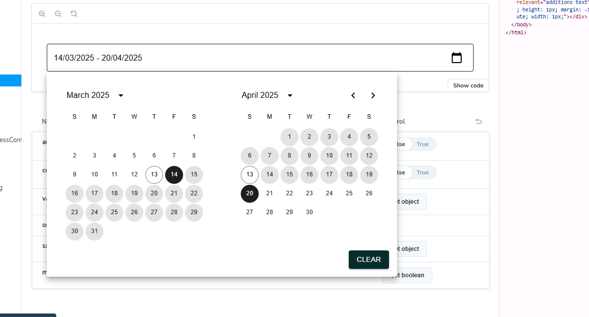
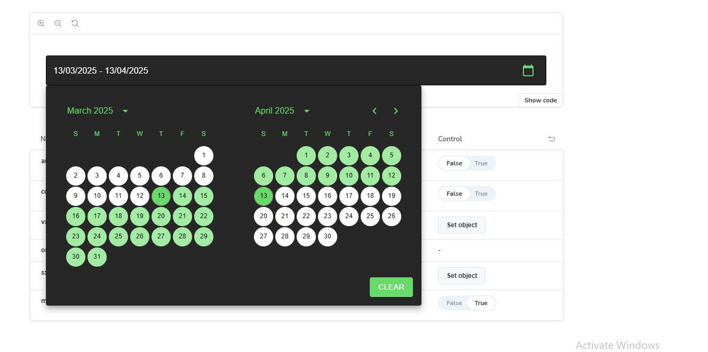
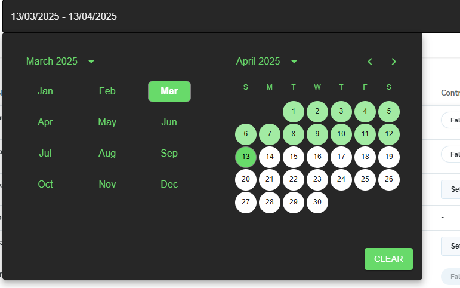

## VDatePicker Documentation

VDatePicker is a customizable date picker component designed for seamless integration into your React applications. It provides a user-friendly interface for selecting dates.

## Features 


- `Year Selection`: Allows users to select a year from a dropdown.

- `Month Selection`: Provides a dropdown to select a specific month.

- `Clear Option`: Includes a button to clear the selected date.

- `Customization`: Supports various customization options such as styles, formats, and width etc.

- `Dark Mode Support` : Toggle between dark and light themes using the mode prop.


### Installation

To install VDatePicker, run the following command:

```
npm install @vplatform/shared-components

```

If the shared-components package is already installed, upgrade it to version 1.7.43 or above:

```
npm install @vplatform/shared-components@1.7.43

```

### Usage

Import and use VDatePicker in your application:


```
import React, { useState } from "react";
import { VDatePicker } from "@vplatform/shared-components";

const App = () => {

    const [selectedDates, setSelectedDates] = useState<[Dayjs | null, Dayjs | null]>([
        dayjs("2025-03-01"), 
        dayjs("2025-04-10")
    ]);
    const handleChange = (e: DateRange<any>) => {
		const [start, end] = e;
		console.log("state and end date", start, end);
	};

    return (
        <VDatePicker
            value = {selectedDates}
            onChange={handleChange}
            consider2YearRange={true}
            sx={{ width: "500px" }}
        />
    );
};

export default App;

```

### Props Explanation

#### 1) autoFocus (boolean, optional)

- If true, the date picker will automatically focus on the input field when mounted. 

#### 2) value (DateRange<Dayjs>, optional)

- The selected date range, where value[0] representation the start date and value[1] representation the end date.

#### 3) onChange ((dateRange: DateRange<Dayjs>) => void, required)

- Callback function triggered when the date range is updated. It returns the updated DateRange<Dayjs>.

#### 4) sx (object, optional)

- Custom styling object that allows additional styles to be applied.

#### 5) consider2YearRange (boolean, optional)

- If consider2YearRange is true, the component checks whether the difference between the startDate and endDate is more than 2 years.
- If the range exceeds 2 years, an error is triggered, preventing selection.

#### 6) mode (boolean, optional)
- If true, the date picker will use a dark theme.
- If false, the date picker will use a light theme (default).



