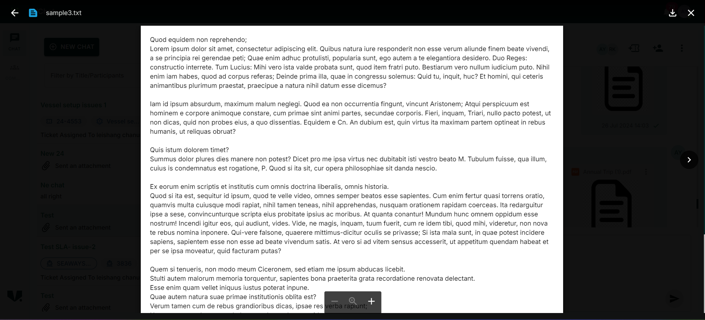
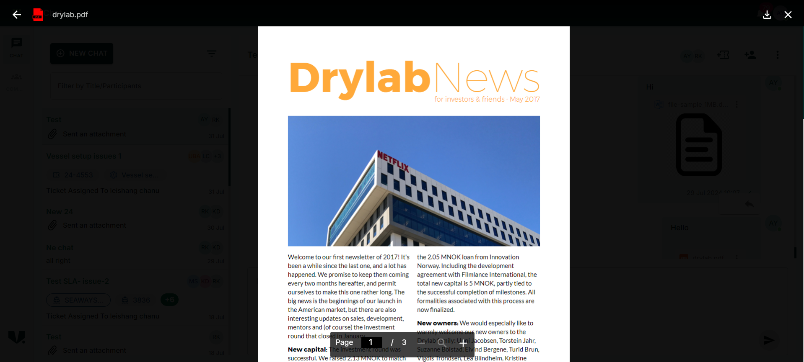
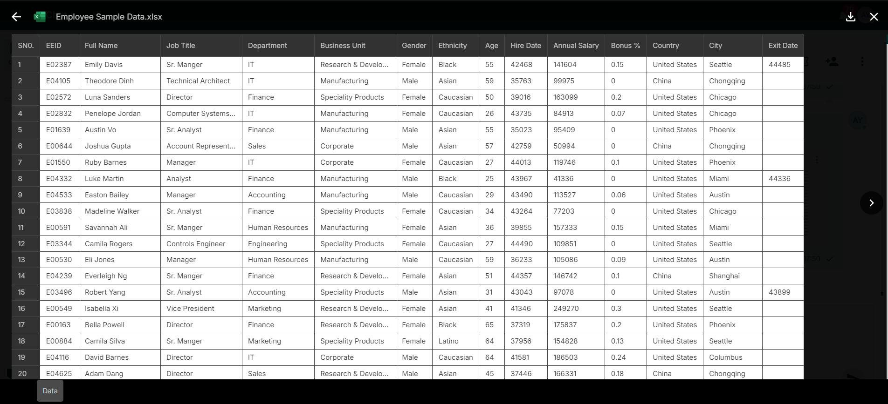

### Introduction 

- The DocumentPreview component is used to display a full-screen preview of attachments, such as images, documents,Excel, Pdf, Video, Md, Txt etc. This component utilizes dynamic imports to load the preview component from an external microfrontend.








- You'll need to configure your project correctly to load remote components. Here are the steps you can follow:

## Step 1: Configure next.config.js

###  Add the Remote Module Federation Configuration

- In your next.config.js, you need to define the remote module where your DocumentPreview component is hosted.

```
  remotes: {
            microfrontend: `microfrontend@${process.env.NEXT_PUBLIC_MICROFRONTEND_BASE_API_URL}/_next/static/      chunks/remoteEntry.js`,
    },
```

## Step 2: Set Environment Variable

- Make sure you have the NEXT_PUBLIC_MICROFRONTEND_BASE_API_URL environment variable defined in your .env file

```
NEXT_PUBLIC_MICROFRONTEND_BASE_API_URL = https://dev.shipsure.com/remote
```

## Step 3: Use the DocumentPreview Component

### 1. Dynamic Import of the Component

- Create DocumentPreview.tsx file in common component.
- This file will be responsible for dynamically importing the DocumentPreview component.

```

import dynamic from "next/dynamic";
import React, { useMemo } from "react";

export const AttachmentPreview = (props: any) => {
	const DocumentPreview = useMemo(
		() =>
			dynamic<any>(
				// eslint-disable-next-line @typescript-eslint/ban-ts-comment
				// @ts-ignore
				() => import("microfrontend/previewattachment"),
				{
					ssr: false,
				},
			),
		[], // Dependency array is empty since this memoized value doesn't depend on any props
	);

	return <DocumentPreview {...props} />;


}
```

### 2. Integrate DocumentPreview into Your Application

```
import { AttachmentPreview } from "@/components/common/AttachmentPreviewMicro";
import React, { useState } from "react";

const Attachment = () => {
	const [isOpenPopup, setIsOpenPopup] = useState(false);

	const handleClosePopup = () => {
		setIsOpenPopup(false);
	};

	const files = [
		{
			thumbnailData:
				"blob:http://localhost:3000/e95ce604-591d-49b5-8d02-da51d197769b",
			id: 48846,
			fileType: "txt",
			fileName: "sample3.txt",
			fileURL:
				"blob:http://localhost:3000/79ee3f40-046d-4b12-ae3e-06a38aa13637",
			fileObj: {},
			isNoAllowedToDelete: false,
			isLoadedForFullScreenData: true,
			thumbnailFileURL:
				"blob:http://localhost:3000/e95ce604-591d-49b5-8d02-da51d197769b",
			createdBy: "a768baa0-1c6e-4f1a-abc2-aafaf93f6f17",
			createdOn: "2024-07-26T09:19:11.903Z",
			DocId: 48846,
			Extension: "txt",
			Name: "sample3",
			Thumbnail: 48844,
			documentypeId: "1",
			versionId: 1,
			activeVersion: true,
			customerId: "1",
			schemaId: 1,
			description: "",
			friendlyFileName: "sample3.txt",
			status: 1,
			updateBy: null,
			updateOn: null,
			thumbnailId: "48844",
			isDownable: "true",
			isReplicable: "true",
			isLowBandwidth: "true",
			tags: [
				{
					key: "channelId",
					value: "11070",
				},
				{
					key: "Content-Type",
					value: "text/plain",
				},
			],
			access: [],
			documentId: 48846,
			_id: "66a36a0fc9390fd78a1b8844",
		},

		...more,
	];
	return (
		<div>
			<AttachmentPreview
				filePreviewOrderList={files}
				isOpenPopup={isOpenPopup}
				closePopup={handleClosePopup}
			/>
		</div>
	);
};

export default Attachment;

```


## Props 

- The component accepts the following props:

#### 1. filePreviewOrderList: (IFile[]) :

-  An array of files that you want to display in the preview. Each file should conform to the IFile interface, which may include attributes like name, url, and type.

#### 2. isOpenPopup: (boolean) :

-  A boolean value to control the visibility of the popup. Set to true to display the popup, and false to hide it.

#### 3. closePopup: (Callback function) : 

- A callback function that is called to close the popup. This function should handle changing the state that controls the isOpenPopup prop.


