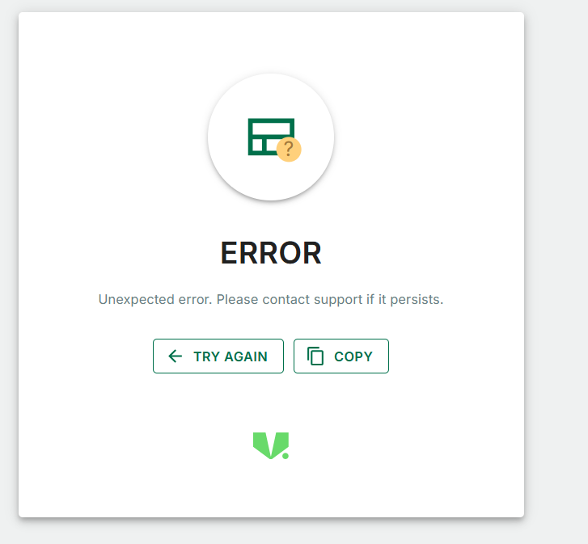
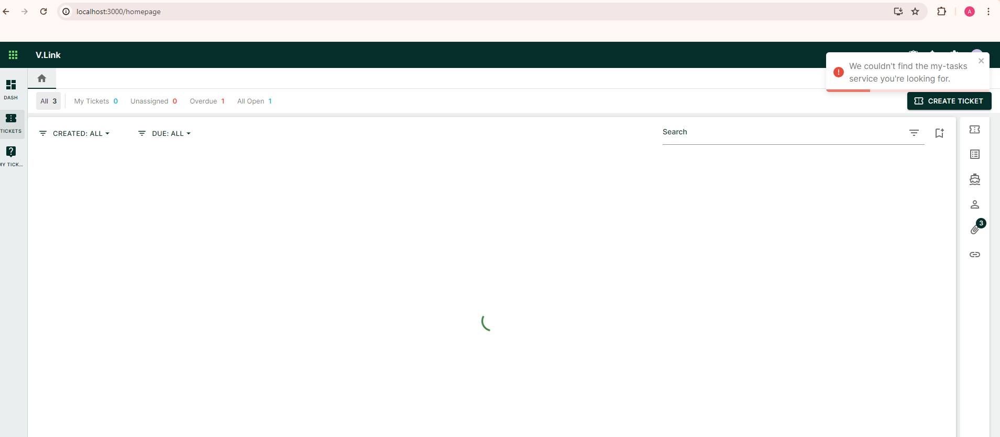
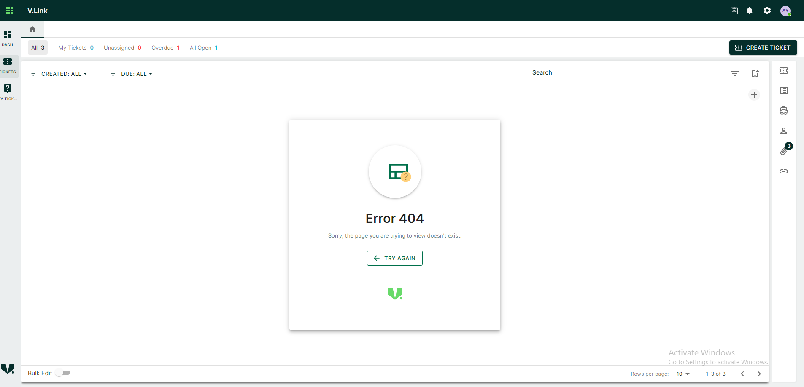

### Introduction
Error handling is a critical part of building robust and user-friendly applications. This guide provides best practices and examples for handling errors in a Next.js application at various levels: 

1. Root level (page level).
2. Component level.
3. API level.


## 1. Page-Level Error Handling
- Page-level error handling refers to managing errors that occur within the pages of your Next.js application.
- Page-level error handling in a Next.js application using the `react-error-boundary` package. This approach helps ensure that errors occurring at the page level are caught and managed gracefully, providing a better user experience.
- The `@vplatform/shared-components` package appears to be a custom package developed specifically for our application.

### 1. Installation

To install the  `@vplatform/shared-components` and `react-error-boundary` package.
```
npm install @vplatform/shared-components

npm install react-error-boundary
```

### 2. Create the Error Fallback Component 

First, we need to create a component that will serve as the fallback UI when an error is caught. This component will display a user-friendly message and provide an option to retry or navigate away from the error state.


```
 // pages/ErrorFallback.tsx

import React from "react";
import { FallbackProps } from "react-error-boundary";
import { VErrorFallBack } from "@vplatform/shared-components";

const ErrorFallback = React.memo(
	({ resetErrorBoundary, error, absolute, titleMessage, subMessage }: FallbackProps & { absolute?: boolean }) => (
		<VErrorFallBack resetErrorBoundary={resetErrorBoundary} error={error} absolute = {absolute} />
	),
);

ErrorFallback.displayName = "ErrorFallback";

export default ErrorFallback;

```

Note: 1. resetErrorBoundary function is clearing the error and allowing the component tree to re-render as if no error had occurred.
    

### 3. Use the Fallback Component in _app.js

To ensure that the custom error page is used throughout the application, we will wrap the entire application with an ErrorBoundary in the _app.js file.


```
import type { AppProps } from "next/app";
import { ErrorBoundary } from "react-error-boundary";
import ErrorFallback from "./ErrorFallback";

function MyApp({ Component, pageProps }: AppProps) {
    return(
        <ErrorBoundary FallbackComponent={ErrorFallback}>							
	        <Component {...pageProps} />
        </ErrorBoundary>
    )
}
```



## 2 API-Level Error Handling

- Handling errors in API routes is crucial for ensuring that your backend can gracefully handle unexpected issues and provide informative responses to the client.
- Use `react-toastify` to display error notifications on the client side.

### 1. Installation 

To install the @vplatform/shared-components and react-toastify package.

```
npm install @vplatform/shared-components

npm install react-toastify
```

### 3. Setup react-toastify in Your Application

In your main application file (e.g., _app.js), configure react-toastify to display toasts.

```
import React from 'react';
import { ToastContainer } from 'react-toastify';
import 'react-toastify/dist/ReactToastify.css';

function MyApp({ Component, pageProps }) {
  return (
    <>
      <ToastContainer />
      <Component {...pageProps} />
    </>
  );
}

export default MyApp;
```

### 2. Implement Error Handling in an API Route

Next, use the HandleError utility function in your API routes to handle any errors that may occur.

#### Props

The VHandleError function accepts two parameters:

1. error (any) : The error object received from an API response or other sources.
2. titleMessage (string?): Optional Title error for the error fallback. 
2. subMessage (string?): Optional subtext error for the error fallback.  

##### VHandleErrorOptions

This interface defines the structure for customizing error messages.

1. service (string, optional): The name of the service for which the error occurred. If provided, the error message will include the service name.
2. customMessage (string, optional): A custom error message to be displayed. If provided, this message will override the default error message for the specific error code.
3. suppressMessage (string , optional) : To control whether the error toast is displayed.

    Possible values:

      - "true": Error toast won't be display.
      
      - "false": By default, error toast will be display.

```

import { VHandleError } from "@vplatform/shared-components";


export default async (req, res) => {
  try {
    // Your API logic here  
  } catch (error) {
    VHandleError(error, {customMessage : 'Your custom error message'}, process.env.NEXT_PUBLIC_SUPPRESS_API_TOASTER_ERROR_MESSAGE)
  }
};

Or 

export const getActiveTicketTypes = () => {
	const url = 'api url';
	return vLinkServiceAxios.post(url).catch((error) => VHandleError(error, {service : 'contact'}));
};

Or

export const getActiveTicketTypes = () => {
	const url = 'api url';
	return vLinkServiceAxios.post(url).catch((error) => VHandleError(error, {customMessage : 'Your custom error message'}));
};
```

Note: Don't use both 'service' and 'customMessage'.

Note: Add `NEXT_PUBLIC_SUPPRESS_API_TOASTER_ERROR_MESSAGE="true" ` to your environment file (.env) if you want to suppress the error toast notifications.

### 3 Define Error Messages 

In our error handling utility, define specific error messages based on the HTTP status code. Here is an example:

```

400: customMessage || (service ? `Oops! Something went wrong with ${service} service. Please check and try again.` : "Oops! Something went wrong. Please check and try again."),
401: customMessage || (service ? `Unauthorized access to the ${service} service. Please log in and try again.` : "Unauthorized access. Please log in and try again."),
403: customMessage || (service ? `You don't have permission to access the ${service} service.` : "You don't have permission to access this service."),
404: customMessage || (service ? `We couldn't find the ${service} service you're looking for.` : "We couldn't find the service you're looking for."),
405: customMessage || "This action is not allowed.",
429: customMessage || "You're making requests too quickly. Please slow down.",
500: customMessage || "Our servers are having issues. Please try again later.",
502: customMessage || "There was a problem with the server. Please try again later.",
503: customMessage || (service ? `${service} service is temporarily unavailable. Please try again later.` : "Service is temporarily unavailable. Please try again later."),
504: customMessage || "The server took too long to respond. Please try again later.",


```
Note:- If the status code is 401 or 403, the toast notification is skipped.





## 3. Component-Level Error Handling 

- To handle errors at the component level using react-error-boundary, you can identify a common or main component where you can apply the ErrorBoundary and a fallback component. 
- This ensures that errors occurring within the component subtree are caught and managed gracefully, displaying a user-friendly fallback UI.

### 1. Create the Error Fallback Component 

First, create a reusable component that will serve as the fallback UI when an error is caught. This component will display an error message and provide an option to retry or navigate away from the error state.


```
 // components/ErrorFallback.tsx

import React from "react";
import { FallbackProps } from "react-error-boundary";
import { VErrorFallBack } from "@vplatform/shared-components";

const ErrorFallback = React.memo(
	({ resetErrorBoundary, error, absolute }: FallbackProps & { absolute?: boolean }) => (
		<VErrorFallBack resetErrorBoundary={resetErrorBoundary} error={error} absolute = {absolute} />
	),
);

ErrorFallback.displayName = "ErrorFallback";

export default ErrorFallback;

```

 ### 2. Identify a Common or Main Component

Identify a main or common component where you want to apply the ErrorBoundary. This is typically a component high up in your component tree, such as the layout component or a main section of your application.

### 3. Apply the ErrorBoundary Component

Wrap the identified component with the ErrorBoundary component from react-error-boundary and provide the ErrorFallback component as the fallback UI.

```
// components/common/Layout.tsx

import React from 'react';
import { ErrorBoundary } from 'react-error-boundary';
import ErrorFallback from './ErrorFallback';

const Layout = ({ children }) => {
  return (
    <ErrorBoundary FallbackComponent={(props) => <ErrorFallback {...props} absolute={true} />}>
      <div>
        {/* Your layout content */}
        {children}
      </div>
    </ErrorBoundary>
  );
};

export default Layout;

```
Note : 1. To dynamically control the positioning of the ErrorBoundary component such that it centers itself only when absolute is true.



## Deployment related steps

### Step 1: Update azure-pipelines.yml

Check if `npmAuthenticate` is enabled or not. If not, then enable it like below.

```yaml
stages:
- stage: BuildPublishandDeploy 
  displayName: Build image, publish to DockerHub, and deploy to k8s
  jobs: 
  - template: Pipeline-templates/Jobs/docker_build_publish_deploy.yml@templates
    parameters:
      serviceName: $(serviceName)
      k8sManifestPath: $(k8sManifestPath)
      env_name: $(env)
      chart_Path: $(chart_Path)
      release_Name: $(release_name)
      npmAuthenticate: true # Ensure this option is enabled
      value_File_Path: $(k8sManifestPath)
      runCodescan: true
```

### Step 2: Update Dockerfile

Review your Dockerfile for the following steps and replace them with the updated commands:

```shell
# Replace these two steps
COPY package.json package-lock.json ./
RUN npm install

# With these steps
COPY package.json package-lock.json ./
COPY .npmrc ./
RUN npm ci --force
RUN rm -f .npmrc
```


## Benefits of Using Error Handling

- Implementing error handling significantly enhances the quality and reliability of your application. It ensures a better user experience by providing clear feedback and maintaining application stability
- By leveraging tools like react-error-boundary and react-toastify, you can effectively manage errors and improve the overall health of your Next.js application.
- Reusable error fallback components and utilities reduce code duplication and ensure consistency across the application.
- Users encounter user-friendly messages instead of application crashes or blank screens. This helps maintain trust and reduces frustration.
