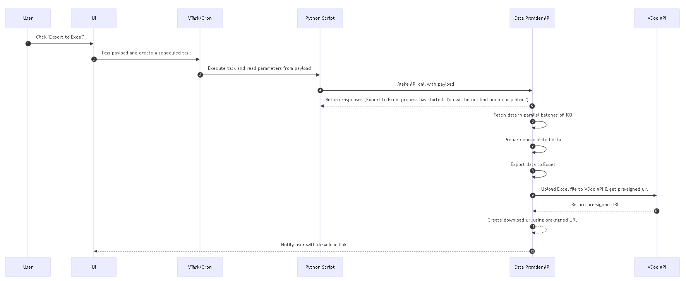

# Export to Excel Implementation Guide - Documentation

## Overview
This document provides an overview of the implementation for exporting data to Excel in Vlink, including API endpoints, Python script workflow, task creation, and frontend integration. You can use the same approach in your application.

## Overall Workflow




### Steps to Implement Export to Excel Workflow

1. **Create an API Endpoint** that:
   - Fetches all the required data
   - Creates an Excel document
   - Uploads the document
   - Generates a download URL
   - Sends a notification with the download URL
2. **Develop a Python script** to invoke the above endpoint.
3. **Implement frontend logic** to create a scheduled task with all the necessary payloads.


## Below is Vlink Export To Excel  Implementation


### Step 1 : Create Python script

In this script, the Python argument is received in `str(sys.argv[1])`, which is then converted into an object using `json_string_to_object`. The type of this object is `ScriptPayload`, which represents the argument passed in the task payload.

#### Workflow of the Python Script
1. Parse the JSON string received from the Python argument.
2. Send a request to the endpoint with the required payload.


```
import json
import os
import sys
from urllib.parse import urlencode, urljoin
import logging
import traceback
import requests

logging.basicConfig(level=logging.INFO, format="%(asctime)s - %(levelname)s - %(message)s")

class DisplayColumn:
    def __init__(self, fieldName, displayColumnName):
        self.fieldName = fieldName
        self.displayColumnName = displayColumnName
        
    def to_dict(self):
        return {"fieldName": self.fieldName, "displayColumnName": self.displayColumnName}


class ExportDataBody:
    def __init__(self, taskIds, pageNumber, pageSize, displayColumns):
        self.taskIds = taskIds
        self.pageNumber = pageNumber
        self.pageSize = pageSize
        self.displayColumns = [DisplayColumn(**col) for col in displayColumns]
        
    def to_dict(self):
        return {
            "taskIds": self.taskIds,
            "pageNumber": self.pageNumber,
            "pageSize": self.pageSize,
            "displayColumns": [col.to_dict() for col in self.displayColumns]
        }
        
        
class ExportExcelRequestBody:
    def __init__(self, exportDataBody, taskId, sourceApplicationId, userId,customerId,uploadDocumentTypeId,exportExcelColumns):
        self.exportDataBody = ExportDataBody(**exportDataBody)
        self.taskId = taskId
        self.sourceApplicationId = sourceApplicationId
        self.userId = userId
        self.customerId = customerId
        self.uploadDocumentTypeId = uploadDocumentTypeId
        self.exportExcelColumns = exportExcelColumns
    
    def to_dict(self):
        return {
            "exportDataBody": self.exportDataBody.to_dict(),
            "taskId": self.taskId,
            "sourceApplicationId": self.sourceApplicationId,
            "userId": self.userId,
            "customerId": self.customerId,
            "uploadDocumentTypeId": self.uploadDocumentTypeId,
            "exportExcelColumns": self.exportExcelColumns
        }

# Represents the script payload (arguments passed to the script)requirement
class ScriptPayload:
    def __init__(self, exportDataUrl, exportExcelRequestBody):
        self.exportDataUrl = exportDataUrl
        self.exportExcelRequestBody = ExportExcelRequestBody(**exportExcelRequestBody)
        

# Custom Exception for handling errors in the export process
class ExportExcelException(Exception):
    def __init__(self, message, original_exception=None):
        super().__init__(f"ERROR EXPORT EXCEL: {message}")
        self.original_exception = original_exception
        if original_exception:
            self.traceback = traceback.format_exc()


def main():
    log('Script execution started.')
    
    if len(sys.argv) > 1:
        json_string = str(sys.argv[1])
         
        script_payload = json_string_to_object(json_string, ScriptPayload)

        response = post_api(script_payload)
        log(f'process started: {response}.')
        
    else:
        raise ExportExcelException('No argument passed.')
        
    log('Script execution completed.')


# Function to call the API and initiate export
def post_api(script_payload: ScriptPayload):
    token = get_token(script_payload.exportExcelRequestBody.customerId)
    headers = {'Authorization': f'Bearer {token}'}
    
    try:
        url = script_payload.exportDataUrl
        body = script_payload.exportExcelRequestBody.to_dict()
        response = requests.post(url, headers=headers, json=body)
        
        if response.status_code >= 200 and response.status_code < 300:
            return response.text
        else:
            raise ExportExcelException(f"Failed POST API: {response.text}")

    except Exception as e:
        raise ExportExcelException("Error in fetch_post_api", e)

# Function to obtain authentication token
def get_token(customer_id):
    try:
        
        omni_jwt_issuer = os.environ.get('OMNI_JWT_ISSUER')
        omni_client_id = os.environ.get('CLIENT_ID')
        omni_client_secret = os.environ.get('CLIENT_SECRET')
        
        if omni_jwt_issuer:
            omni_jwt_issuer = omni_jwt_issuer.split(',')[0]
 
            url = generate_url(omni_jwt_issuer, 'connect/token')
            
            data = {
                "grant_type": 'client_credentials',
                "client_id": omni_client_id,
                "client_secret": omni_client_secret,
                "CustomerId": customer_id
            }
            encoded_data = urlencode(data)
            headers = {"Content-Type": "application/x-www-form-urlencoded"}
            response = requests.post(url, data=encoded_data, headers=headers, verify=True)
            success = response.json()
            return success["access_token"]
    except Exception as error:
        raise ExportExcelException(f"Error in get token", error)

# Converts JSON string to a specific object type
def json_string_to_object(json_string, class_type):
    try:
        data = json.loads(json_string)
        object_instance = class_type(**data)
        return object_instance
    except Exception as error:
        raise ExportExcelException(f"Error in converting json string to object", error)


def log(message):
    logging.info(f"EXPORT EXCEL: {message}")


def generate_url(base_url, path=''):
    if not base_url.endswith('/'):
        base_url += '/'
    full_url = urljoin(base_url, path)
    return full_url


if __name__ == "__main__":
    main()

```

### Step 2: Upload the Python Script to the Task Library
1. Upload the script to **Shipyard**: [`https://dev.shipsure.com/shipyard`](https://dev.shipsure.com/shipyard).
2. Obtain the **Library ID** for reference in the frontend integration.

### Step 3: Create API Endpoint
This endpoint will handle:
1. Fetching required data
2. Processing the data for Excel
3. Generating the Excel document
4. Uploading the document to VDocument Service
5. Generating a download URL
6. Sending a notification with the download URL


Install this below package

```bash
npm i exceljs date-fns
```

```typescript

// vlink.controller.ts

export class VLinkController {
  constructor(private readonly exportToExcelWorkflowService: ExportToExcelWorkflowService) { }

@Post('export-to-excel')
  @ApiOperation({
    summary: 'Export to excel.',
    description: 'This endpoint exports the provided data into an Excel file.',
  })
  @ApiCreatedResponse({
    description: 'Excel file export has been successfully initiated.',
    type: String,
  })
  @ApiBody({
    description: 'Request body to exported to Excel.',
    type: ExportExcelDataRequest,
  })
  async exportExcelData(
    @Body() request: ExportExcelDataRequest,
    @DecodeJwtToken() decodedToken: any,
  ): Promise<string> {
    const { customerId } = _getDecodedTokenData(decodedToken);
    this.exportToExcelWorkflowService.exportData(request,customerId);
    return Message.EXPORT_EXCEL_PROCESS_MESSAGE;
  }

}
  ```


  ```typescript
//message.constant.ts

export const Message = {
  EXPORT_EXCEL_PROCESS_MESSAGE: 'Export to Excel process has started. You will be notified once completed.',
};

  ```


```typescript
  //export-to-excel.request.dto.ts

  import { ApiProperty } from '@nestjs/swagger';
import { Type } from 'class-transformer';
import {
    IsArray,
    IsInt,
    IsNotEmpty,
    IsNumber,
    IsObject,
    IsString,
    ValidateNested,
} from 'class-validator';

class DisplayColumn {
    @ApiProperty({
        description: 'Field name of the column.',
        example: 'status',
        type: String,
        required: true,
    })
    @IsString()
    @IsNotEmpty()
    fieldName: string;

    @ApiProperty({
        description: 'Display column name.',
        example: 'Status',
        type: String,
        required: true,
    })
    @IsString()
    @IsNotEmpty()
    displayColumnName: string;
}

class ExportDataBody {

    @ApiProperty({
        description: 'Task IDs to export.',
        example: [13813, 13795, 13794],
        type: [Number],
        required: true,
    })
    @IsArray({ message: 'taskIds must be an array of numbers.' })
    @IsNumber({}, { each: true, message: 'Each TaskId must be a number.' })
    taskIds: number[];

    @ApiProperty({
        description: 'Page number for pagination.',
        example: 1,
        type: Number,
        required: true,
    })
    @IsInt({ message: 'Page number must be an integer.' })
    pageNumber: number;

    @ApiProperty({
        description: 'Page size for pagination.',
        example: 10,
        type: Number,
        required: true,
    })
    @IsInt({ message: 'Page size must be an integer.' })
    pageSize: number;

    @ApiProperty({
        description: 'List of columns to be displayed in the export.',
        example: [
            { fieldName: 'status', displayColumnName: 'Status' },
        ],
        type: [DisplayColumn],
        required: true,
    })
    @IsArray()
    @IsNotEmpty({ message: 'displayColumns cannot be empty.' })
    @ValidateNested({ each: true })
    @Type(() => DisplayColumn)
    displayColumns: DisplayColumn[];

}

export class ExportExcelDataRequest {


    @ApiProperty({
        description: 'export data request body.',
        example: {
            taskIds: [
                12907,
                12904,
                12902,
                12892
            ],
            pageNumber: 1,
            pageSize: 25,
            displayColumns: [
                {
                    fieldName: "TICKETNUMBER",
                    displayColumnName: "Ticket No."
                },
                {
                    fieldName: "TITLE",
                    displayColumnName: "Name"
                },
                {
                    fieldName: "VESSEL",
                    displayColumnName: "Vessel Name"
                }
            ]
        },
        type: ExportDataBody,
        required: true,
    })
    @IsObject()
    @IsNotEmpty({ message: 'exportDataRequestBody cannot be empty.' })
    @ValidateNested()
    @Type(() => ExportDataBody)
    exportDataBody: ExportDataBody;


    @ApiProperty({
        description: 'Task ID for the export request.',
        example: 12345,
        type: Number,
        required: true,
    })
    @IsNumber({}, { message: 'taskId must be a number.' })
    taskId: number;

    @ApiProperty({
        description: 'Source application ID.',
        example: '0896c4c3-e70b-4f84-9054-d6b57e5351d2',
        type: String,
        required: true,
    })
    @IsString()
    @IsNotEmpty()
    sourceApplicationId: string;

    @ApiProperty({
        description: 'User ID making the export request.',
        example: '48ab3eaf-f856-4339-a004-4fe62b9544c7',
        type: String,
        required: true,
    })
    @IsString()
    @IsNotEmpty()
    userId: string;

    @ApiProperty({
        description: 'List of columns to be exported in the Excel file.',
        example: ['Vessel Name', 'Resolver Group'],
        type: [String],
        required: true,
    })
    @IsArray()
    @IsString({ each: true })
    exportExcelColumns: string[];

    @ApiProperty({
        description: 'Document type ID for the upload.',
        example: 5,
        type: Number,
        required: true,
    })
    @IsNumber({}, { message: 'uploadDocumentTypeId must be a number.' })
    uploadDocumentTypeId: string;

}

```
```typescript
//export-excel-workflow.service.ts

import { Injectable } from "@nestjs/common";
import { LoggerHelperService } from "src/common/services/logger-helper.service";
import { Workbook } from 'exceljs';
import { existsSync, promises as fsPromise, mkdirSync } from 'fs';
import axios, { AxiosResponse } from 'axios';
import * as path from 'path';
import { JWT_ISSUER, OMNI_JWT_CLIENT_ID, OMNI_JWT_CLIENT_SECRET, VDOCUMENTNODEJS_URL, VNOTIFICATION_BASE_API_URL, VTASK_BASE_API_URL } from "src/config";
import { join } from "path";
import { ExportExcelDataRequest } from "../dtos/request";
import { UUID } from "mongodb";
import { isValid, format, parseISO } from 'date-fns';

@Injectable()
export class ExportToExcelWorkflowService {
    constructor(
        private readonly loggerHelperService: LoggerHelperService
    ) { }

    async exportData(requestDto: ExportExcelDataRequest, customerId: number): Promise<void> {

        const requestId = new UUID().toString();

        try {

            const taskDisplayColumns = await this.fetchAllTaskDisplayColumns(requestDto, customerId);

            const filePath = await this.createExcelDocument(requestDto, taskDisplayColumns);

            const uploadResponse = await this.uploadDocument(requestDto, filePath, customerId);

            const preSignedUrlParams = uploadResponse["preSignedUrlParams"]
            const downloadUrl = `${VDOCUMENTNODEJS_URL}/v1/pre-signed/download${preSignedUrlParams}`

            await this.sendNotification(requestDto, downloadUrl, customerId);

        } catch (error) {
            this.loggerHelperService.logData(
                'ExportToExcelWorkflow',
                customerId,
                error.stack,
                "Export To Excel failed",
                requestId,
                true
            )
        }
    }

    private async fetchAllTaskDisplayColumns(requestDto: ExportExcelDataRequest, customerId: number): Promise<any> {
        const token = await this.getOmniToken(customerId);
        const headers = { Authorization: `Bearer ${token}` };
        const url = `${VTASK_BASE_API_URL}/v1/my-tasks-display-columns`;

        const request = requestDto.exportDataBody;

        const { data: firstPageResponse } = await axios.post(url, request, { headers }) as AxiosResponse<{
            paginationResponse: {
                totalRecords: number;
            };
            result: any[];
        }, any>;

        const totalRecords = firstPageResponse.paginationResponse.totalRecords;
        const totalPages = Math.ceil(totalRecords / request.pageSize);

        let allResults = [];
        allResults = allResults.concat(firstPageResponse.result);

        if (totalPages > 1) {
            const fetchPage = async (pageNumber: number) => {
                const pageRequest = {
                    ...request,
                    pageNumber,
                };

                const { data } = await axios.post(url, pageRequest, { headers });
                return data.result;
            };

            const tasks = [];
            for (let page = 2; page <= totalPages; page++) {
                tasks.push(fetchPage(page));
            }

            const pageResults = await Promise.all(tasks);

            pageResults.forEach((result) => {
                allResults = allResults.concat(result);
            });
        }

        return allResults;
    }

    private async createExcelDocument(requestDto: ExportExcelDataRequest, data: any[]): Promise<string> {

        const reportsDir = join(process.cwd(), 'reports');

        if (!existsSync(reportsDir)) {
            mkdirSync(reportsDir, { recursive: true });
        }

        const workbook = new Workbook();
        const worksheet = workbook.addWorksheet('Exported Data');

        const exportExcelColumns = requestDto.exportExcelColumns || [];

        worksheet.columns = exportExcelColumns.map(h => ({ header: h, key: h }))

        data.forEach(row => {
            const rowData = exportExcelColumns.map(column => this.getRowData(row, column));
            const addedRow = worksheet.addRow(rowData);

            addedRow.eachCell((cell, colNumber) => {
                const value = cell.value;

                if (this.isValidDate(value)) {
                    cell.numFmt = 'd-mmm-yyyy';
                }
            });

        });

        const currentDateTime = this.getFormattedDateTime();

        const fileName = `ticketlist_${currentDateTime}.xlsx`;
        const filePath = path.join(reportsDir, fileName);
        await workbook.xlsx.writeFile(filePath);
        return filePath;
    }

    private async uploadDocument(requestDto: ExportExcelDataRequest, filePath: string, customerId: number): Promise<{ preSignedUrlParams: string }> {
        const token = await this.getOmniToken(customerId);
        const fileBuffer = await fsPromise.readFile(filePath);
        const fileBlob = new Blob([fileBuffer], { type: 'application/vnd.openxmlformats-officedocument.spreadsheetml.sheet' });
        const url = `${VDOCUMENTNODEJS_URL}/v1/pre-signed/uploadDocument`;

        const formData = new FormData();
        formData.append('file', fileBlob, path.basename(filePath));
        formData.append('documentypeId', requestDto.uploadDocumentTypeId);
        formData.append('isDownable', "true");
        formData.append('isReplicable', "true");
        formData.append('isLowBandwidth', "true");

        const headers = { Authorization: `Bearer ${token}` };

        const response = await axios.post(url, formData, { headers });

        await fsPromise.unlink(filePath);

        return response.data;
    }

    private async sendNotification(
        requestDto: ExportExcelDataRequest,
        downloadUrl: string,
        customerId: number
    ): Promise<void> {
        const token = await this.getOmniToken(customerId);

        const notificationPayload = {
            sender: requestDto.userId,
            receiver: [{ userId: requestDto.userId }],
            state: "Pending",
            subject: 'Your Excel File is Ready!',
            body: `<p>Click <a href="${downloadUrl}" download>Download</a> to get your file.</p>`,
            redirectURL: downloadUrl,
            icon: "ChatOutlinedIcon",
            acknowledgedDateTime: null,
            acknowledgedBy: null,
            acknowledgementType: "Direct",
            sourceApplicationId: requestDto.sourceApplicationId,
            acknowledgementRequired: false,
            priority: "Urgent",
            notificationId: 1,
            createdDateTime: new Date().toISOString(),
            taskId: requestDto.taskId
        };

        const headers = { Authorization: `Bearer ${token}` };
        const url = `${VNOTIFICATION_BASE_API_URL}/v1/notify`;
        await axios.post(url, notificationPayload, { headers });
    }

    private async getOmniToken(customerId: number): Promise<string> {

        if (!JWT_ISSUER || !OMNI_JWT_CLIENT_ID || !OMNI_JWT_CLIENT_SECRET) {
            throw new Error('Missing required environment variables');
        }

        let issuer = JWT_ISSUER;

        if (issuer.includes(',')) {
            issuer = issuer.split(',')[0];
        }

        const url = this.generateUrl(issuer, 'connect/token');

        const data: any = {
            grant_type: 'client_credentials',
            client_id: OMNI_JWT_CLIENT_ID,
            client_secret: OMNI_JWT_CLIENT_SECRET,
            CustomerId: customerId,
        };

        const encodedData = new URLSearchParams(data).toString();
        const headers = { 'Content-Type': 'application/x-www-form-urlencoded' };

        const response = await axios.post(url, encodedData, { headers });
        const success = response.data;
        return success.access_token;
    }

    private generateUrl(baseUrl: string, path: string = ''): string {
        if (!baseUrl.endsWith('/')) {
            baseUrl += '/';
        }
        const fullUrl = new URL(path, baseUrl).toString();
        return fullUrl;
    }

    private getFormattedDateTime() {
        const currentDate = new Date();
        return format(currentDate, 'yyyy-MM-dd_HH-mm-ss');
    }

    private isValidDate(str: any) {
        try {
            const parsedDate = parseISO(str);
            return isValid(parsedDate);
        } catch (error) {
            return false
        }
    }

    private getRowData(row: any, column: string): any {

        const rowData = row[column];

        if (rowData === undefined || rowData === null) {
            return ""
        } else if (!isNaN(rowData)) {
            return rowData;
        }
        else if (this.isValidDate(rowData)) {
            return new Date(rowData);
        } else {
            return rowData;
        }
    }

}

```

Import ExportToExcelWorkflowService in module

```typescript
import { Module } from '@nestjs/common';
import { VLinkController } from './controllers/vlink.controller';
import { INTERFACES } from '../common/v1/constants';
import { VLinkRepository } from './repositories/vlink.repository';
import { VLinkService } from './services/vlink.service';
import { MongoDBModule } from 'src/common/database/mongodb.module';
import MSTSAuthService from 'src/common/services/msts-auth.service';
import { CacheModule } from '@nestjs/cache-manager';
import { AuthModule } from '@vplatform/auth';
import { LoggerHelperService } from 'src/common/services/logger-helper.service';
import { VLoggerModule } from '@vplatform/logger';
import { ExportToExcelWorkflowService } from './services/export-excel-workflow.service';

@Module({
  imports: [MongoDBModule, CacheModule.register(),
    AuthModule.register({issuer: process.env.OMNI_JWT_ISSUER}), VLoggerModule
  ],
  controllers: [VLinkController],
  providers: [
    VLinkService,
    ExportToExcelWorkflowService,
    {
      provide: INTERFACES.IVLINKPOSITORY,
      useClass: VLinkRepository,
    },
    MSTSAuthService,
    LoggerHelperService

  ],
})
export class VLinkModule {}


```

Change in DockerFile 


```Dockerfile
RUN mkdir -p /usr/src/app/reports && \
    chown -R node:node /usr/src/app/reports

```

After adding above line it will look something like this

```Dockerfile

FROM node:18-alpine as builder

USER node

WORKDIR /usr/src/app

COPY --chown=node:node .npmrc ./
COPY --chown=node:node package*.json ./

RUN npm ci

RUN rm -f .npmrc

COPY --chown=node:node . .

RUN npm run build \
    && npm prune --production


FROM node:18-alpine

ENV NODE_ENV production

RUN mkdir -p /usr/src/app/logs && \
    chown -R node:node /usr/src/app/logs

RUN mkdir -p /usr/src/app/reports && \
    chown -R node:node /usr/src/app/reports

USER node

WORKDIR /usr/src/app

COPY --from=builder --chown=node:node /usr/src/app/node_modules/ ./node_modules/
COPY --from=builder --chown=node:node /usr/src/app/dist/ ./dist/

CMD ["node", "dist/main.js"]


```

In gitignore add this 

```bash
/reports
```


### Step 4: Vlink frontend changes

1. Create Manual type task.
2. Get the taskId.
3. Get task Entity.
4. Update Task type to ***Schedule*** task and add all ***payload**.

Add that library Id in env

```bash
NEXT_PUBLIC_EXPORT_TO_EXCEL_PYTHON_SCRIPT_LIBRARY_ID = <library Id>
```

```typescript

const [isLoading, setIsLoading] = useState(false);
const [localSelectedColumns, setLocalSelectedColumns] =
		useState<Columns[]>(columnsConfig);

const handleExportToExcel = async () => {
		try {
			setIsLoading(true);

			const loggedInUserDetails: any = jwtDecode(
				new AuthService().getOMNITokenData()?.access_token || "",
			);

			const now = new Date();
			const formattedDate = now
				.toLocaleString("en-GB", {
					day: "2-digit",
					month: "2-digit",
					year: "2-digit",
					hour: "2-digit",
					minute: "2-digit",
					second: "2-digit",
					hour12: false,
				})
				.replace(",", "");

			const libraryId = Number(
				process.env.NEXT_PUBLIC_EXPORT_TO_EXCEL_PYTHON_SCRIPT_LIBRARY_ID,
			);

			const createTaskRequest = {
				schemaId: 1,
				type: taskTypeEnum.MANUAL,
				source: `VLink`,
				sourceURL: ``,
				description: `VLink Tickets Export To Excel: ${formattedDate}`,
				status: MESSAGE_STATUS_ENUM.OPEN,
				labels: [
					{
						key: "TITLE",
						value: `VLink Tickets Export To Excel: ${formattedDate}`,
					},
				],
				taskExecutionType: "Python Script",
			};

            // Call Create Task V3 api
			const createTaskResponse = await createTicketV3Api(createTaskRequest);
			const taskId = createTaskResponse.data.result;

            // Call Get Task V3 api
			const taskResponse = await getTaskByTaskIdApiV3(taskId);
			const task = taskResponse.data.result;

			task.type = taskTypeEnum.SCHEDULER;
			task.payload = {
				libraryId,
				data: {
					// above Endpoint which is created
                    exportDataUrl: `${process.env.
                    NEXT_PUBLIC_VLINK_BASE_API_URL}/v1/export-to-excel`, 

                    // request Body
					exportExcelRequestBody: {
						exportDataBody: {
							taskIds,
							pageNumber: 1,
							pageSize: 100,
							displayColumns: localSelectedColumns?.map(column => ({
								fieldName: column.field,
								displayColumnName: column.headerName,
							})),
						},

                        //Task Id which is used to store notification under specific task for persistent.
						taskId,

                        //application Id
						sourceApplicationId: process.env.NEXT_PUBLIC_CLIENT_ID,

                        //User Id which get notify
						userId: loggedInUserDetails.sub,
						customerId: loggedInUserDetails.CustomerId,

                        // Based on project id will change. You can get from Document Service Team. 
						uploadDocumentTypeId: 5, 
						
                        // Columns which is need to export in excel.
                        exportExcelColumns: localSelectedColumns?.map(
							column => column.headerName,
						),
					},
				},
			};

			task.scheduleDetails = [
				{
					startDate: new Date(),
					type: "onetime",
				},
			];

            // Call Update Task V4 api
			await updateTicketTaskApiV4(taskId, task);
			enqueueSnackbar({
				variant: "success",
				icon: <CheckCircleIcon />,
				onClose: () => closeSnackbar(),
				message: (
					<Box mt={-1} display="flex" alignItems="center">
						<Box>
							<Typography variant="subtitle1" fontWeight="bold">
								Request Submitted
							</Typography>
							<Typography variant="body2">
								We will notify you when the excel get generated.
							</Typography>
						</Box>
					</Box>
				),
			});
			setIsLoading(false);
		} catch (error) {
			console.error("Export to excel =>", error);
		} finally {
			setIsLoading(false);
		}
	};


```