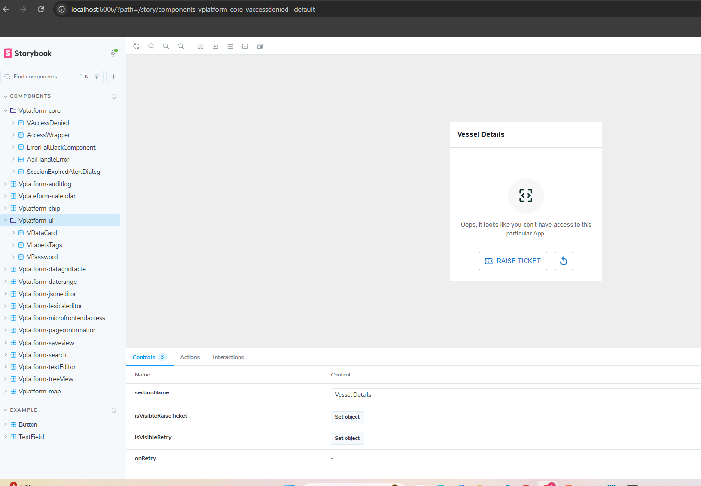

## Monorepo Packages Documentation
This monorepo uses Vite + React + TypeScript with Storybook for UI components documentation. Each package lives under the packages/ directory and is published as an npm package under the @vplatform scope.

### Why We Use Monorepo with Storybook
#### 1. Centralized Package Management

- All UI components (e.g., @vplatform/button, @vplatform/input) live in one repository.

- Easier to maintain versions, dependencies, and consistency across the design system.

- No need to jump between multiple repos.

✅ Benefit: Faster development, single source of truth for all packages.

#### 2. Reusability & Consistency

-Each package is self-contained and reusable across multiple applications.

-Ensures consistent UI/UX across projects since all apps import from the same @vplatform/* packages.

✅ Benefit: Reduced duplication, more reliable code.

#### 3. Faster Development with Storybook

- Storybook acts as a living documentation for all components.

- Developers and designers can see, test, and interact with components in isolation.

✅ Benefit: Better collaboration between devs & designers, fewer UI bugs.

#### 4. Easy Scalability

- Adding a new package (@vplatform/newcomponent) is simple and follows the same structure.

- Monorepo tooling (like pnpm, yarn workspaces, or nx) ensures shared build tools and configs.

✅ Benefit: Scales smoothly as the design system grows.

#### 5. 📖 Clear Documentation

- Every package has its own stories inside Storybook.

- Acts as a component library + documentation site.

- New team members can easily explore components without digging into code.

✅ Benefit: Faster onboarding, less knowledge gap.

#### 6. Easier Maintenance

- Shared linting, testing, and build scripts across all packages.

- Updating dependencies can be done in one place for all packages.

✅ Benefit: Saves time and avoids version mismatches.


### How to create packages.

To create a new package inside the monorepo, follow these steps:

1. Navigate to the packages folder
2. Copy an existing package of vplatform-button and paste into packages folder itself.
3. Update the package name which you copy, such as vplatform-newcomponent
4. Go to the `packages/vplatform-newcomponent/package.json` file and update
- Change the `name` field:
- Start the version with 1.0.0.
```
{
  "name": "@vplatform/newcomponent",
  "version": "1.0.0",
  "main": "dist/index.js",
  "module": "dist/index.es.js",
  "types": "dist/index.d.ts"
}

```

- Every component must live inside  `packages/vplatform-newcomponent/src/` 
- If you add files outside src/, you must update tsconfig.json with the correct include paths.
- Structure: 
```

packages/vplatform-newcomponent/
├── src/
|   |── components
│   ├── index.tsx
└── index.tsx
├── package.json
└── tsconfig.json

```
5. Export the component and type (same pattern as button package) and update `packages/vplatform-newcomponent/src/index.tsx`

```
export { default as VNewComponent } from "./NewComponent";
export type { VNewComponentProps } from "./NewComponent";
```

```
import React from "react";

export interface VNewComponentProps {
  label: string;
}

const VNewComponent: React.FC<VNewComponentProps> = ({ label }) => {
  return <button>{label}</button>;
};

export default VNewComponent;
```

6. Export the package from root of package( `packages/vplatform-newcomponent/index.tsx`) so package.json can consume.

```
export { VNewComponent } from "./src";

```

6. Add the dependencies in `packages/vplatform-newcomponent/package.json` which is required to your component and install from root directory.
(root directory :- `PS C:\Users\Anisha.Yadav\Documents\Project\vplatform-components>`)
`first add the dependencies like:
```
  "dependencies": {
    "react-infinite-scroll-component": "^6.1.0",
    "@mui/x-data-grid-pro": "7.12.0",
    "@emotion/react": "^11.11.1",
  }
```
- Go to the root directory then run `npm i`

7. Every package have their own common, interface, style, lib, components etc.

8. Add the package stories (newcomponent.stories.tsx) into `stories/src/stories` folder.

9. After that Build the packages for that run `npm run build:all` from root directory of the project. After build you can see the changes in storybook. Run storybook with `npm run storybook` command.

- Note : All npm commad must run from the root directory of the project. (`PS C:\Users\Anisha.Yadav\Documents\Project\vplatform-components>`)

10. After that add package to the tsconfig.json file of the root directory `C:\Users\Anisha.Yadav\Documents\Project\vplatform-components\tsconfig.json`. 

- update the path in tsconfig.json file

```
   "@vplateform/newcomponent": ["./packages/vplatform-newcomponent"],
      "@vplateform/newcomponent/package.json": [
        "./packages/vplatform-newcomponent/package.json"
      ]
```
11. update the `.gitignore file` 

- if node_modules exits

```
packages/vplatform-newcomponent/node_modules

```
- if dist exits

```
packages/vplatform-newcomponent/dist

```

12. In storybook call your package, for that add your package into `stories/package.json` file. And run `npm i` form root directory

``` 
"dependencies": {
        "@vplatform/newcomponent": "1.0.0"
}
```

13. In storybook add the title of your component similar to below line:-

```
const meta: Meta<typeof VAccessDenied> = {
	title: "components/Vplatform-newcomponent
}
```

14. Storybook have their own css, interface, lib etc. 

```
import type { Meta, StoryObj } from "@storybook/react-vite";
import { VNewComponent } from "@vplatform/newcomponent";

const meta: Meta<typeof VDataCard> = {
	title: "components/Vplatform-newcomponent",
	component: VNewComponent,
	parameters: {
		docs: {
			description: {
				component:
					"This is VNewComponent",
			},
		},
	},
	tags: ["autodocs"],
};

export default meta;

type Story = StoryObj<typeof meta>;

export const Default: Story = {};

```

15. Build your storybook book with this command - `npm run build-storybook` from root directory. If you go the error of 

```
Error:
crpyto.hash is not a function
```

then check the node js verion in you local. 
node js version should be 22.16.0. 

run that command line in local terminal
``` 
Set-ExecutionPolicy -Scope CurrentUser -ExecutionPolicy RemoteSigned
```

### How to Connect Packages to Your App in Local Development.

1. First run `npm run build:all` in vplatform-components app. 
2. Update the package.json for your host app(vchat), such as

```
    "@vplatform/newcomponent": "file:C:/Users/Anisha.Yadav/Documents/Project/vplatform-components/packages/newcomponent",
```
3. After then do npm i in host app(vchat). 

4. Add below config in host applicaiton next.config.js file

```
const path = require('path')
```

```
  config.resolve.alias = {
  ...(config.resolve.alias || {}),
  react: path.resolve(__dirname, 'node_modules/react'),
  'react-dom': path.resolve(__dirname, 'node_modules/react-dom'),
};
```

5. if you got below error: 

```
Module parse failed: Unexpected token (1:7) You may need an appropriate loader to handle this file type, currently no loaders are configured to process this file. See https://webpack.js.org/concepts#loaders

```

6. Then install the babel loader in your host application

```
"@babel/preset-env": "^7.28.3",
"@babel/preset-react": "^7.27.1",
"@babel/preset-typescript": "^7.27.1",
"babel-loader": "^10.0.0",
```


### How to Update Existing Packages

1. Make Code Changes

Go to the package you want to update (e.g., @vplatform/button) and make your changes.


2. Make sure your changes don’t break anything:

```
npm run build:all
```

3. Bump the package version in @vplatform/button/package.json:

```
patch (bug fixes, e.g., 1.0.0 → 1.0.1)

minor (new features, e.g., 1.0.0 → 1.1.0)

major (breaking changes, e.g., 1.0.0 → 2.0.0)

```

4. Update the version in `stories/src/stories/packages.json` file:

```
@vplatform/button : 1.0.1
```

5. Commit your changes and raise the PR.

### How to Consume the Package in Other Applications

1. Install the Package in application.

```
npm i @vplatform/button@1.0.1

```
2. Import and Use in Your Code.

```
import { Button } from "@vplatform/button";

export default function MyApp() {
  return (
    <div>
      <h1>Hello World</h1>
      <Button label="Click Me" />
    </div>
  );
}
```


### All Existing packages and components inside packages:

1. import {VAuditLogs} from '@vplatform/auditlog'
2. import {VCalendar} from '@vplatform/calendar'
3. import {Chips} from '@vplatform/chip'
4. import {VAccessDenied, AccessWrapper , VHandleError, VErrorFallBack, VSessionExpiredAlertDialog} from '@vplatform/core'
5. import {VDataGridTable} from '@vplatform/datagridtable'
6. import {VDatePicker} from '@vplatform/daterange'
7. import {VJsonEditor} from '@vplatform/jsoneditor'
8. import {LexicalEditor} from '@vplatform/lexicaleditor'
9. import {VMicroFrontendAccessControl} from '@vplatform/microfrontendaccess'
10. import {VPageConfirmation} from '@vplatform/pageconfirmation'
11. import {VQuickFilters} from '@vplatform/quickfilter'
12. import {VSaveView} from '@vplatform/saveview'
13. import {VSearchInput} from '@vplatform/search'
14. import {VTextEditor} from '@vplatform/texteditor'
15. import {VTreeView} from '@vplatform/treeview'
16. import {VDataCard, VLabelsTags, VPassword} from '@vplatform/ui'
17. import {VMapComponent} from '@vplatform/map'

