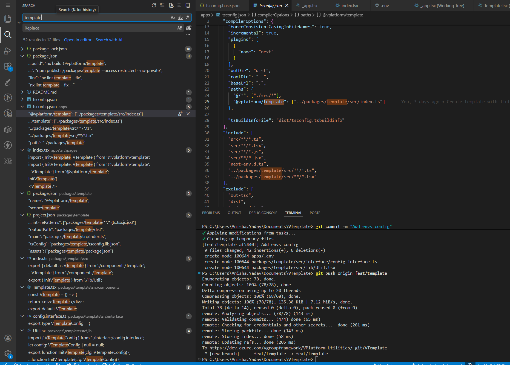
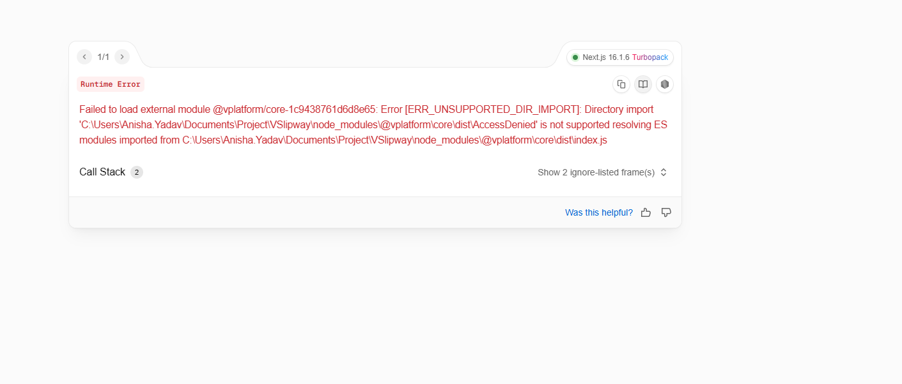

VPlatform Nx Monorepo – Template Usage Guide
============================================

Overview
-----------

This repository uses **Nx Monorepo architecture** to manage applications and shared packages.

The @vplatform/template package provides a reusable base template that developers can use to quickly bootstrap new applications with consistent structure, configuration, and best practices.

Project Structure
====================


```sh
📂apps 
|
+-- 📂public
|
+-- 📂src
|    |
|    +-- 📂 pages
|
📂 packages
|
+-- 📂 package-name
|    |
|    +-- 📂 src
|    |    |
|    |    +-- 📂 components
|    |    |
|    |    +-- 📂 interface
|    |    |
|    |    +-- 📂 styles
|    |    |
|    |    +-- 📂 lib
|    |
|    +-- 📄index.ts

```


apps/
=====

The apps directory contains **runnable applications** or Preview of the application.

Each folder inside apps/ is a standalone application (Next.js, React, etc.).

### 📂 public

*   Stores static assets.
    
*   Examples: images, SVGs, JSON files, fonts.
        

### 📂 src

*   Includes pages folder.

*   Import components from shared packages

*   Pass required props

*   Handle environment variables

*   Configure routing


**Important Rule:** Applications consume shared packages, but should not depend on other applications.

packages/
============

The packages directory contains **reusable shared libraries**.

These are not standalone apps — they are meant to be imported and reused inside apps.


packages/package-name/
=========================
* Example package names: appbar, slipway, template, etc.

Each package follows a clean internal structure.

* Example packages/appbar packages/slipway etc 

📂 src/
-------

Contains all internal source code of the package.

This keeps implementation details organized.

📂 components/
--------------

*   Reusable UI components.
    
*   Example: Button, Modal, Layout, Card.
    
*   Should be generic and reusable.
    

📂 interface/
-------------

*   TypeScript interfaces and type definitions.
       

📂 styles/
----------

*   Package-specific styles.
        
*   Keeps styling isolated to the package.
    

📂 lib/
-------

*   Core logic and helper functions.
    
*   Business-independent utilities.
    
*   Shared internal functions used by components.


📄 index.ts
------------------------------------

This is the **most important file in the package**.

It controls what the outside world can import.

Example:
``` 
export { default as VTemplate } from './components/Template';
export { InitVTemplate } from './lib/Util';

```


How Developer Should Create a New Package repo?
=========================================

Developers **do NOT need to create a new app using Nx commands**.

Instead, they should use the existing template project as a base and customize it.

Step 1: Copy the Template Application
---------------------------------------

1.  Go to the existing Vtemplate  (example):
    
https://dev.azure.com/vgroupframework/VPlatform-Utilities/_git/VTemplate


2.  Copy the entire folder and files.
    

Step 2: Rename All "template" References
------------------------------------------

After copying, you must replace all occurrences of:

```   
template   
```

with your new package name.

Example:

```   
template  →  slipway  
template  →  appbar  
```

Search template in repo and modify with you package name
NOTE:- Don't modify the package-lock.json, docs 
NOTE:-  Replace the package/template folder to your packagename (ex:- packages/slipway)




    

Step 3: Update Package Usage
------------------------------

Inside the package/packagename/package.json:

*   Replace @vplatform/template with your required package name.


Step 4: Update Props and Configuration
----------------------------------------

Update only:

*   Application name
    
*   Environment variables
    
*   Props passed to the package
    
*   Routing (if necessary)
    

Do NOT modify internal package logic inside apps/.

Important Rules
==================

*   Do NOT add business logic inside apps/
    
*   Do NOT modify shared package structure
    
*   Do NOT create new apps using nx g command
    
*   Always use template as the base structure
    

Architecture Principle
=========================

```   
Copy Template → Rename → Update Package Name → Configure Props → Done   
```

All reusable logic must remain inside packages/.


Environment Configuration Guide
===============================

The package exposes:

```   
export { InitVPackageName } from './lib/Util';   
```

The package must be initialized using InitPackageName (change name according to you package).

How Environment Configuration Works
======================================

Update the VTemplateConfig interface according to your require envs

```

export type VTemplateConfig = {
  DefaultIconUrl: string;
  VSecurityBaseUrl: string;
  STSAutorityUrl: string;
};

```
Developers only need to provide values for these fields.


### Initialize Env function in App

Inside your application entry file (e.g., page.tsx, layout.tsx, or _app.tsx):

import { VPackage, InitVPackageName } from '@vplatform/packageName';

```
InitVPackageName({
  DefaultIconUrl: process.env.NEXT_PUBLIC_DEFAULT_ICON_URL as string,
  VSecurityBaseUrl: process.env.NEXT_PUBLIC_VSECURITY_BASE_URL as string,
  STSAutorityUrl: process.env.NEXT_PUBLIC_STS_AUTHORITY_URL as string,
});

export default function Page() {
  return <VPackage />;
}

``` 
Consume Configuration in Components in packages folder

```

import { getConfig } from '../../lib/Util';

const AppBar = () => {
  const { VPrsenceAPIUrl } = getConfig();
  return <></>
}
```
### Structure

```
.env (App Layer)
        ↓
App reads process.env
        ↓
App calls InitVTemplate(config)
        ↓
Package consumes config internally

```

### How to Run the package preview and build the application.

Run the application use

```
npm run dev
```

Build the packages folder use

```
npm run build
```
Build the apps folder use

```
npm run build:apps
```


### How to Fix the `Failed to load External Module`

If you are using any external package such as @vplatform/core and got below error



then Go to the next.config.js file in your application and Add @vplatform/core package into transpilePackages array.

```
//@ts-check

// eslint-disable-next-line @typescript-eslint/no-var-requires
const { composePlugins, withNx } = require('@nx/next');

/**
 * @type {import('@nx/next/plugins/with-nx').WithNxOptions}
 **/
const nextConfig = {
  // Use this to set Nx-specific options
  // See: https://nx.dev/recipes/next/next-config-setup
  nx: {},
  transpilePackages: ['@vplatform/core', '@vplatform/slipway'],
};

const plugins = [
  // Add more Next.js plugins to this list if needed.
  withNx,
];

module.exports = composePlugins(...plugins)(nextConfig);

```