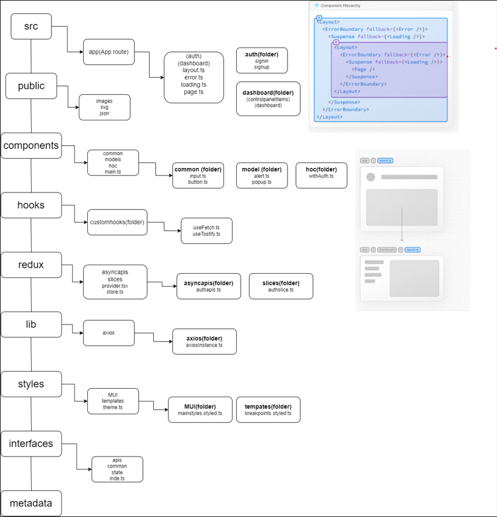

# 🗄️ Project Structure

Most of the code lives in the `src` folder and looks like this:

```sh

📂public   
|
+-- 📂images
|
+-- 📂svg
|
+-- 📂json
|
📂src
|
+-- 📂app               
|    +-- 📂(group-1)
|           |
|           +-- 📂feature-1
|              |
|              +-- 📄page.tsx
|          |
|          +-- 📂feature-2
|              |
|              +-- 📄page.tsx    
|          |
|          +-- 📄error.tsx
|          |
|          +-- 📄layout.tsx
|          |
|          +-- 📄page.tsx
|          
|    +-- 📂(group-2)
|           |
|           +-- 📂feature-1
|              |
|              +-- 📄page.tsx
|          |
|          +-- 📂feature-2
|              |
|              +-- 📄page.tsx    
|          |
|          +-- 📄error.tsx
|          |
|          +-- 📄layout.tsx
|          |
|          +-- 📄page.tsx
|          
|    +-- 📄error.tsx     
|    |
|    +-- 📄layout.tsx     
|    |
|    +-- 📄page.tsx    
|    |
|    +-- 📄loading.tsx  
|    |
|    +-- 📄global.css
|
+-- 📂components       
|    |
|    +-- 📂hoc        
|       |
|    +-- 📂models       
|       |
|    +-- 📂common        
|       |
|    +-- 📄components.ts
|
+-- 📂hooks
|    |
|    +-- 📂customshooks
|              |
|              +-- 📄useCustom.ts                  
|
+-- 📂interfaces        
|    |
|    +--  📂api          
|    |
|    +-- 📂common        
|    |
|    +-- 📂state        
|
+-- 📂lib             
|
+-- 📂redux
|    |
|    +-- 📂asyncapis
|    |
|    +-- 📂slices
|    |
|    +-- 📄provider.tsx
|    |
|    +-- 📄store.ts
|
+-- 📂styles           
|    |
|    +-- 📂mui 
|    |
|    +-- 📂template  
|    |
|    +-- 📄theme.ts  
|    
+--  📂metadata

```



# Project Components Overview

This project utilizes three types of components categorized based on the folder structure and their intended usage across the application.

## 1. public directory
### Description:
This directory contains all static assets used in the project, such as images, SVG files, and JSON files.

## 2. src directory
### Description:
This directory contains the source code of the project.

###  app:
- This allows you to organize your route segments and project files into logical groups without affecting the URL path structure.
- To create multiple root layouts, remove the top-level layout.js file, and add a layout.js file inside each route groups.
- Reference : https://nextjs.org/docs/app/building-your-application/routing/route-groups

###  components:
- This directory contains reusable components organized into different categories.
- hoc: Contains higher-order components (HOCs)
- models: Contains data models or interfaces representing data structures used in the application. Example :- `alert.ts, popup.ts` etc.
- ui: Contains UI components that can be reused across the application.

### hooks:
- This directory contains the customhooks. Example:- `useFetch.ts, useToastify.ts` etc.

### interfaces:
-  This directory contains TypeScript interfaces used to define data structures and types within the project.
-  api: This subdirectory contains interfaces related to API interactions. 
-  common: The common subdirectory contains interfaces that are commonly used throughout the application. 
-  state: The state subdirectory contains interfaces related to application state management. These interfaces define the       structure of the application's state, including data stored in Redux stores, React context providers, or local component     state.


### redux:
- asyncapis: This directory contains files related to asynchronous API calls using Redux middleware. Redux middleware like     Redux Thunk or Redux Saga is commonly used to handle such operations asynchronously.
- slices: This directory contains Redux slice files representing different parts of the application state.
- provider.tsx: This file exports the Redux provider component.
- store.ts: This file exports the Redux store configuration.

### styles:
- mui: This subdirectory contains files related to styling using Material-UI components or styled components. 
- slices: This directory contains Redux slice files representing different parts of the application state.
- provider.tsx: This file exports the Redux provider component.
- store.ts: This file exports the Redux store configuration.

### metadata:
- metadata: This directory likely contains metadata files used in the project. Metadata provides information about other data in the project. 


## 3. Naming convention

### Description: 
The primary goal of any naming convention is consistency. Ensure that the chosen convention is consistently applied throughout the project. Names should be clear and descriptive, making it easy for developers to understand the purpose. 

### interfaces
-  Use a file naming convention like `filename.interfaces.ts`.
-  PascalCase convention typically applies to the names of interfaces. Example: `IUser, IUserProfile` etc.

### variables/method/function
- Variables/method/function naming convention should be camelcase. 
- Example: `variableOne, methodName, functionName` etc.

### constants
- Uppercase characters separated by underscores.
- Example:- `MAX_SIZE, NAME` etc.

### Components
- Components naming convetion should be pascalcase.
- If file contains the JSX then use `.tsx`. If it's pure TypeScript and doesn't have JSX, use `.ts`.
- Component file naming convention :- `Button.ts, MyContainer.ts`etc.
- Component naming convention:- `MyComponent, LoginForm` etc.

### styled-components
- Use a file naming convention like `filename.styled.ts`.
- Naming conventions for styling Example:- `Section, Header, ButtonPrimary` etc.

### higer-order-components(HOC)
- Prefixing the original component's name with `with` is a common convention. For example, if you have a component named Component, the corresponding Higher-Order Component might be named something like withHOC(Component)
- File naming convention : `withAuth.ts` etc
- Component Naming Convention: ` withAuth, withModifiers, withUtilities` etc.

### custome hooks
- Begin the hook name with `use` to indicate that it's a hook.
- Use camelCase for the filename. Example: `usePagination.ts, useLocalStorage.ts` etc.
- Hook name :- `usePagination, useLocalStorage` etc.

## 4. Git 

### Create Branch
- Feature Branches:  For developing new features. Use the prefix feature/. For instance, `feature/login-system`.
- Bugfix Branches: To fix bugs in the code. Use the prefix bugfix/. For example, `bugfix/header-styling`.
- Hotfix Branches: Directly from the production branch to fix critical bugs in the production environment. Use the prefix hotfix/. For instance, `hotfix/critical-security-issue`.
- Release Branches: Used to prepare for a new production release.Use the prefix release/. For example, `release/v1.0.1`
- Documentation Branch:  Used to write, update, or fix documentation. Use the prefix docs/. For instance, `docs/user-guide`.

###  Git commit

#### Type of commit :-
- feat: A new feature or enhancement added to the codebase.
- fix: A bug fix or correction to resolve an issue.
- docs: Documentation changes or updates.
- style: Changes related to code formatting, indentation, or whitespace.
- refactor: Code refactoring without adding new features or fixing bugs.
- test: Addition or modification of test cases.
- chore: Other changes not directly affecting the code (e.g., build scripts, dependencies).

#### Commit messages :-

- length: The first line should ideally be no longer than 50 characters, and the body should be restricted to 72 characters 
- Be Clear and Concise.
- Include Relevant Context
- Use Imperative Verbs: Add, Fix, Update, or Refactor.
- For instance:- 

##### Good
- feat: improve performance with lazy load implementation for images
- chore: update npm dependency to latest version
- Fix bug preventing users from submitting the subscribe form
- Update incorrect client phone number within footer body per client request

##### Bad (Don't Use)
- fixed bug on landing page
- Changed style
- oops
- I think I fixed it this time?
- empty commit messages


### Git commands

#### Create branch:
create new branch
```
git checkout -b <branchname> 
```

#### Delete branch:
Switch to another branch: 
```
git checkout <another-branch-name>
```
Delete the particular branch:
```
 git branch -d <branch-to-delete>
```

#### Cherry-pick:
Git cherry-pick is a Git command used to apply a specific commit from one branch onto another.
```
git cherry-pick <commit-hash>
```
#### commit:

Stage your changes
```
git add .
```
 create the commit 

```
git commit -m "Add feature X"
```

#### rebase :
Use the rebase instead of the merge to avoid the unecessary commits. 
```
git rebase <target-branch>
```
#### revert:
Revert some existing commits
```
git revert <commit-hash>
```
